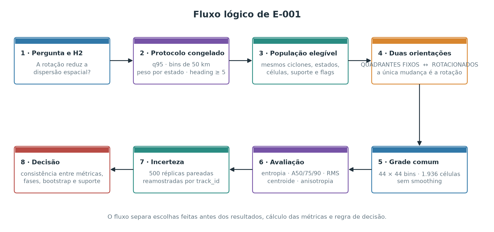
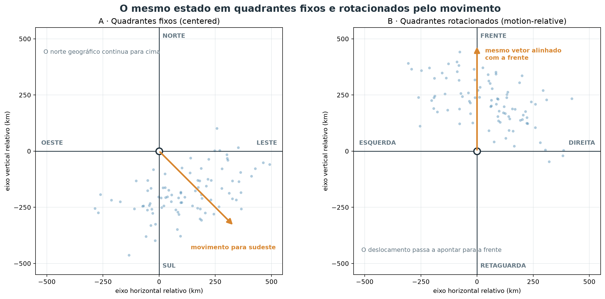
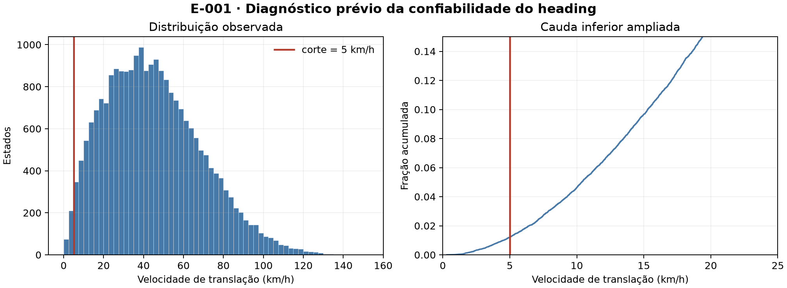
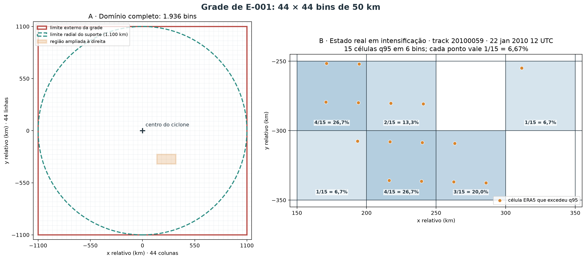
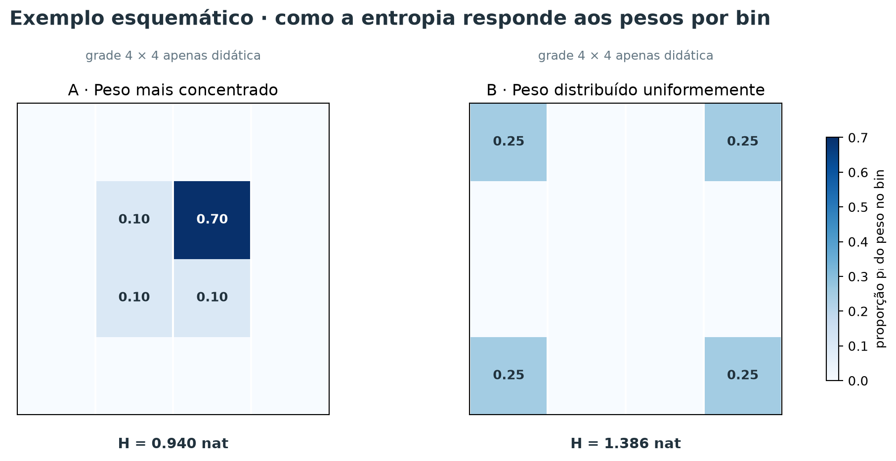
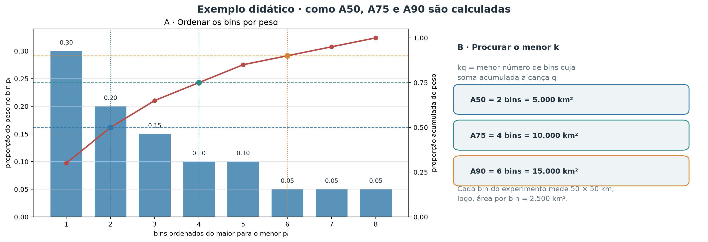
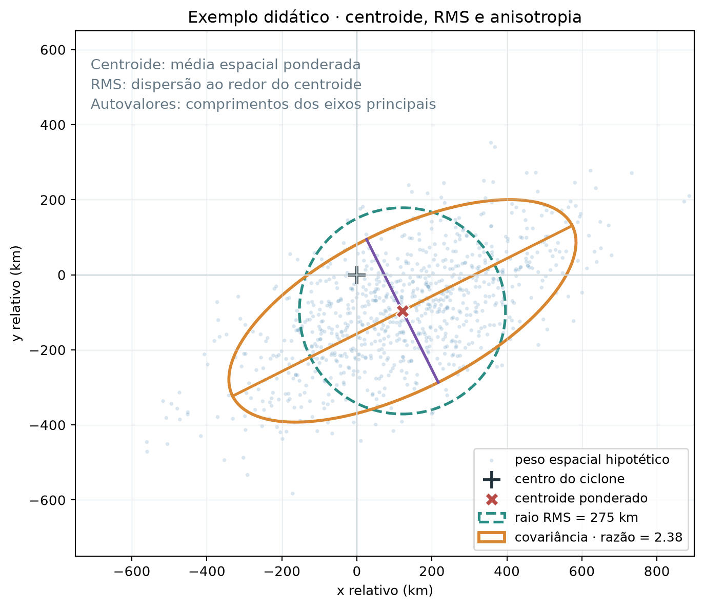
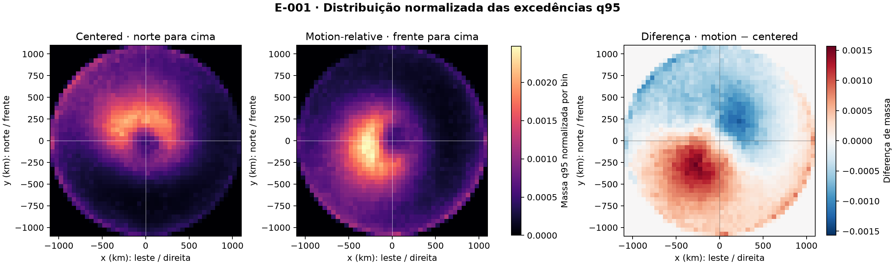
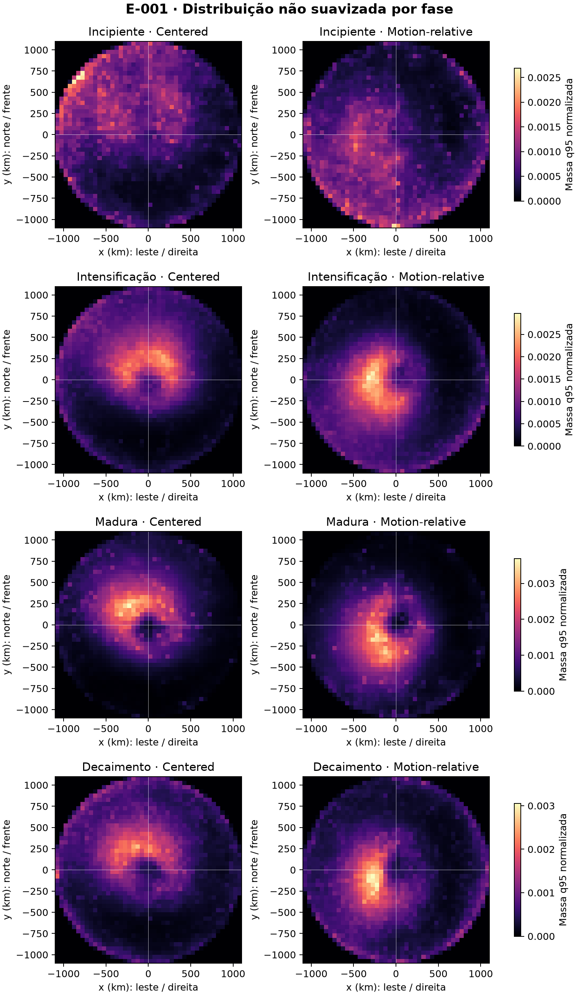
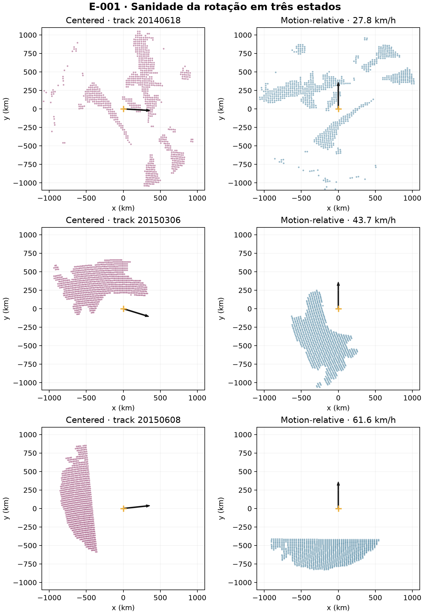

# E-001 — Orientação pelo movimento do ciclone

- **Status:** `INCONCLUSIVE`
- **Planejamento e execução:** 21 de setembro de 2026
- **Hipótese:** H2 — usar quadrantes rotacionados pelo movimento reduz a dispersão espacial das excedências em relação aos quadrantes geograficamente fixos.
- **Questões e decisões relacionadas:** [Q-007](open_questions.md#q-007--a-orientação-pelo-movimento-organiza-melhor-as-excedências) e [D-005](decisions.md#d-005--manter-aberta-a-escolha-entre-centered-e-motion-relative-após-e-001).

## Contexto

Campos de vento de ciclones diferentes podem compartilhar uma organização física e, ainda assim, parecer difusos quando são sobrepostos com o norte geográfico sempre para cima. Isso acontece se a posição preferencial dos extremos acompanha a direção de deslocamento de cada sistema. A representação de **quadrantes rotacionados pelo movimento** (*motion-relative*) gira cada estado para colocar todos os movimentos na mesma direção; a representação de **quadrantes fixos** (*centered*) apenas desloca o centro do ciclone para a origem.

Esses nomes indicam o sistema de referência, não uma divisão da análise em apenas quatro categorias. E-001 usa coordenadas contínuas e uma grade de 44 × 44 bins em ambos os casos. Os identificadores técnicos `centered` e `motion_relative` são preservados nos arquivos CSV/JSON para manter compatibilidade e rastreabilidade.

E-001 é o primeiro teste formal dessa hipótese de representação. Ele não estima *coverage probability*, *footprint* probabilístico ou hazard geográfico. O objeto comparado é mais simples: a distribuição espacial normalizada das ocorrências de excedência do q95 local.

## Pergunta

Mantendo os mesmos ciclones, estados, células, flags de excedência, pesos e bins, os quadrantes rotacionados pelo movimento concentram espacialmente as excedências q95 mais do que os quadrantes fixos?

## Hipótese

H2 previa menor entropia e menor área necessária para concentrar frações fixas do peso normalizado das ocorrências q95 nos quadrantes rotacionados. Fisicamente, esse resultado indicaria que parte da variabilidade aparente em coordenadas geográficas era apenas variabilidade de orientação entre tempestades.

## Hipóteses alternativas e explicações concorrentes

A rotação poderia não ajudar se os extremos fossem organizados sobretudo por fatores geográficos, estrutura interna variável, intensidade ou estágio do ciclone. Também poderia concentrar apenas o núcleo e dispersar a cauda, ou revelar assimetria sem reduzir a dispersão total. Perda de observações perto dos limites do suporte espacial poderia produzir uma mudança artificial; por isso o suporte foi reconstruído e diagnosticado separadamente.

## Visão geral do desenho experimental

O fluxograma abaixo resume a cadeia lógica de E-001, da pergunta à decisão. A comparação é pareada: depois de definida a população elegível, somente o sistema de coordenadas muda entre quadrantes fixos e rotacionados. Bins, pesos, flags q95 e unidades amostrais permanecem idênticos.

<figure class="result-figure">
  
  <figcaption>Fluxo metodológico de E-001. Quadrantes fixos e rotacionados se separam apenas na etapa de orientação e voltam a ser avaliados na mesma grade e pelas mesmas métricas; o bootstrap reamostra ciclones inteiros, sempre de forma pareada.</figcaption>
</figure>

## Dados utilizados

A população partiu do catálogo canônico de estados ERA5 de 6 h derivado do Zenodo 18133432 e do Parquet de vento de 2010–2020. Foram elegíveis os estados no período comparável com suporte espacial — completo ou parcial — e direção de movimento confiável. Estados sem suporte não foram convertidos em zeros.

O q95 local foi fixado antes das métricas principais. A verificação prévia encontrou amostra suficiente nas quatro fases principais: 2.078 estados q95-positivos em fase incipiente, 7.301 em intensificação, 1.821 em fase madura e 4.891 em decaimento, depois do filtro de heading. Os sufixos `2`, que indicam repetição não contígua da mesma fase física, foram agrupados somente nesses quatro estratos; os resultados por rótulo literal permanecem disponíveis. A análise global inclui também estados `residual` e com fase nula; eles não foram forçados a nenhuma das quatro fases.

| Quantidade | Valor |
| --- | ---: |
| Ciclones com suporte antes do filtro de heading | 1.784 |
| Estados com suporte antes do filtro | 23.334 |
| Estados excluídos por heading < 5 km/h | 284 (1,22%) |
| Ciclones no conjunto comparável final | 1.784 |
| Estados no conjunto comparável final | 23.050 |
| Estados com ao menos uma excedência q95 | 16.921 |
| Ciclones com ao menos uma excedência q95 | 1.757 |
| Células q95 excedentes | 9.090.570 |
| Células de suporte efetivamente avaliadas | 136.177.047 |

## Representações comparadas

### Quadrantes fixos (*centered*)

Cada célula é expressa num plano tangente local centrado no ciclone. Sejam `φ₀` e `λ₀` a latitude e longitude do centro e `φ` e `λ` as da célula, todas em radianos; `Δλ` é `λ − λ₀` envolvida em `[-π, π)`. A distância de grande círculo usa:

$$a=\sin^2\left(\frac{\phi-\phi_0}{2}\right)+\cos\phi_0\cos\phi\sin^2\left(\frac{\Delta\lambda}{2}\right).$$

$$d=2R\operatorname{atan2}\left(\sqrt{a},\sqrt{1-a}\right), \qquad R=6\,371\ \text{km}.$$

O azimute `α`, em radianos e no sentido horário a partir do norte, é:

$$\alpha=\operatorname{atan2}\left(\sin\Delta\lambda\cos\phi,\ \cos\phi_0\sin\phi-\sin\phi_0\cos\phi\cos\Delta\lambda\right).$$

As coordenadas no plano tangente são:

$$x = d\sin(\alpha), \qquad y = d\cos(\alpha).$$

Assim, `x > 0` significa leste, `x < 0` oeste, `y > 0` norte e `y < 0` sul. Essa transformação azimutal equidistante esférica preserva a distância radial `d` e evita tratar graus de longitude como distância cartesiana.

### Quadrantes rotacionados pelo movimento (*motion-relative*)

Seja `θ` o heading do ciclone, em radianos, também medido no sentido horário a partir do norte. A rotação usada foi:

$$\begin{bmatrix}x_m\\y_m\end{bmatrix}=\begin{bmatrix}\cos\theta&-\sin\theta\\\sin\theta&\cos\theta\end{bmatrix}\begin{bmatrix}x\\y\end{bmatrix}.$$

Aqui, `x_m` e `y_m` estão em km; `y_m > 0` é a frente do movimento, `y_m < 0` é a retaguarda, `x_m > 0` é a direita e `x_m < 0` é a esquerda. Intuitivamente, a rotação leva o vetor de deslocamento para cima sem alterar a distância ao centro. Por exemplo, para movimento para leste, leste vira frente e sul vira direita.

O Parquet de origem contém as colunas categóricas `fixed_quadrant` e `rotated_quadrant`, que seguem essa mesma ideia. E-001, porém, não usa esses códigos de quatro categorias para calcular as métricas: transforma as posições contínuas `(x, y)` em `(x_m, y_m)` e só depois as discretiza na grade de 44 × 44 bins.

A figura esquemática mostra um ciclone movendo-se para sudeste. À esquerda, os eixos leste–oeste e norte–sul permanecem fixos; à direita, as mesmas células são giradas até o deslocamento apontar para a frente. Os pontos e suas distâncias ao centro são os mesmos nos dois painéis.

<figure class="result-figure">
  
  <figcaption>Exemplo conceitual, não um resultado de E-001. “Quadrantes fixos” e “quadrantes rotacionados” nomeiam os eixos de referência; as posições permanecem contínuas, e não são reduzidas a quatro categorias.</figcaption>
</figure>

## Estimativa da direção de movimento

O heading foi calculado exclusivamente do catálogo completo de estados, nunca das linhas de excedência. Para estados internos de uma track, sejam `r₋ = (x₋, y₋)` e `r₊ = (x₊, y₊)` os centros anterior e posterior projetados, em km, no plano tangente do estado atual, e `t₋`, `t₊` seus horários, em horas. O vetor e o heading são:

$$\mathbf{v}=\frac{\mathbf{r}_{+}-\mathbf{r}_{-}}{t_{+}-t_{-}}, \qquad s=\sqrt{v_x^2+v_y^2}, \qquad \theta=\operatorname{atan2}(v_x,v_y).$$

`vₓ` é a componente leste e `vᵧ`, a componente norte, ambas em km/h; `s` é a velocidade de translação em km/h; `θ` está em `[-π, π]`, medido no sentido horário a partir do norte. Nas extremidades, `r₋` ou `r₊` é substituído pelo próprio estado para formar uma diferença simples de 6 h; nos estados internos, a diferença é centrada em 12 h.

A distribuição foi examinada antes das métricas de concentração. A mediana foi 42,68 km/h, o percentil 1 foi 4,55 km/h e a faixa observada foi 0,31–150,89 km/h. O critério de confiabilidade foi fixado em 5 km/h, equivalente a 30 km em 6 h e aproximadamente uma célula da grade original de 0,25°. Diferentemente do procedimento exploratório herdado, movimentos menores não receberam heading leste artificial.

<figure class="result-figure">
  
  <figcaption>Distribuição usada para auditar o corte de heading. A linha vermelha marca 5 km/h; 284 de 23.334 estados com suporte ficaram abaixo do corte.</figcaption>
</figure>

## Método

As duas representações usaram exatamente os mesmos 23.050 estados, as mesmas células, as mesmas flags q95 e uma grade de 44 × 44 bins de 50 km no domínio `[-1.100, 1.100] km` em cada eixo. Não houve suavização nem máscara mínima de cobertura na análise principal. Cada estado q95-positivo recebeu peso estatístico total igual a um, dividido igualmente entre suas células excedentes. Esse “peso” não é massa física nem magnitude do vento: é apenas a contribuição normalizada do estado para a distribuição espacial. Estados sem q95 permaneceram nas contagens e na auditoria de suporte, mas não definem posição numa distribuição condicionada à ocorrência.

O mapa agregado é, portanto, a distribuição normalizada das ocorrências q95 depois de atribuir o mesmo peso a cada estado q95-positivo. Ciclones mais duradouros ainda podem contribuir com mais estados; resolver *equal-time* versus *equal-cyclone* está fora de E-001.

### Discretização espacial e definição dos bins

Um *bin* é uma célula quadrada usada para reunir as células ERA5 localizadas numa mesma região do sistema de coordenadas relativo. A grade foi fixada antes do cálculo das métricas: 50 km de lado, 44 bins por eixo e 1.936 bins possíveis no quadrado de `2.200 × 2.200 km`. Em notação explícita, as linhas que separam os bins são

$$e_j=-1\,100+50j, \qquad j=0,\ldots,44,$$

e cada bin é

$$B_{jk}=[e_j,e_{j+1})\times[e_k,e_{k+1}), \qquad j,k=0,\ldots,43.$$

Neste texto, três tipos de limite precisam ser distinguidos:

- **divisões internas dos bins:** linhas a cada 50 km que separam um quadrado do seguinte;
- **limite externo da grade:** o quadrado definido por `x = ±1.100 km` e `y = ±1.100 km`;
- **limite radial do suporte:** o círculo de raio 1.100 km ao redor do ciclone. Bins nos cantos do quadrado ficam fora desse círculo e, por construção, não recebem células avaliadas.

O último bin de cada eixo inclui o limite `+1.100 km`, para não perder valores exatamente nesse ponto. Na implementação, uma tolerância numérica de `10⁻⁶ km` é aceita nos quatro limites externos; valores dentro dessa tolerância são associados ao primeiro ou ao último bin, e valores além dela são descartados. A posição de cada célula ERA5, depois da transformação de coordenadas, determina um único `B_jk`. Não há interpolação, suavização ou redistribuição entre bins vizinhos.

O protocolo congelou o lado de 50 km como compromisso entre resolução e estabilidade. A grade ERA5 de `0,25°` representa aproximadamente 28 km no sentido norte–sul e cerca de 20–27 km no sentido zonal nas latitudes da amostra; assim, um bin de 50 km costuma conter apenas algumas células ERA5 de um estado individual. Quando milhares de estados são agregados, o mesmo bin acumula contribuições de muitos estados. Não foi feita uma busca entre várias resoluções nem uma análise de sensibilidade dos bins em E-001.

A figura abaixo mostra primeiro a grade completa. As 44 colunas multiplicadas pelas 44 linhas produzem 1.936 bins; o círculo tracejado mostra o suporte radial efetivamente possível. O segundo painel amplia seis bins ocupados por um estado real elegível. Cada ponto laranja é uma célula ERA5 que excedeu q95 naquele estado — não uma observação inventada.

<figure class="result-figure">
  
  <figcaption>Escala real da discretização. No estado em intensificação do ciclone 20100059 em 22 de janeiro de 2010 às 12 UTC, 15 células q95 ocuparam seis bins; cada ponto contribuiu com 1/15 = 6,67% do peso desse estado. No experimento completo, 1.600 dos 1.936 bins tiveram ao menos uma célula q95 entre os 16.921 estados q95-positivos. Os bins restantes ficam principalmente nos cantos externos ao suporte circular.</figcaption>
</figure>

### Peso por estado e distribuição espacial

Para um estado `s` e um bin `i`, definem-se explicitamente:

$$n_{si}=\text{número de células q95 do estado }s\text{ localizadas no bin }i,$$

$$N_s=\sum_i n_{si}=\text{número total de células q95 do estado }s.$$

O peso que o estado `s` atribui ao bin `i` é

$$w_{si}=\frac{n_{si}}{N_s}, \qquad \sum_i w_{si}=1.$$

Somando as contribuições de todos os estados q95-positivos, obtém-se o peso agregado do bin,

$$W_i=\sum_s w_{si},$$

e sua proporção na distribuição espacial final é

$$p_i=\frac{W_i}{\sum_\ell W_\ell}, \qquad \sum_i p_i=1.$$

Portanto, `p_i = 0,02` significa que o bin contém 2% do peso estatístico normalizado de todas as ocorrências q95. Não significa 2% da massa de ar, 2% da velocidade do vento nem necessariamente 2% das células brutas.

#### Exemplo com um estado real

O estado mostrado na figura anterior, `track_id = 20100059` em `2010-01-22 12:00 UTC`, estava em intensificação, tinha suporte completo e 15 células q95:

$$N_s=15, \qquad \frac{1}{N_s}=\frac{1}{15}=0{,}0667.$$

Cada célula vale, portanto, 6,67% do peso desse estado. Os seis bins receberam:

| Centro do bin `(x, y)`, km | `n_si` | Cálculo de `w_si` | Peso do estado no bin |
| --- | ---: | ---: | ---: |
| `(225, −325)` | 4 | `4/15` | 26,67% |
| `(175, −275)` | 4 | `4/15` | 26,67% |
| `(275, −325)` | 3 | `3/15` | 20,00% |
| `(225, −275)` | 2 | `2/15` | 13,33% |
| `(175, −325)` | 1 | `1/15` | 6,67% |
| `(325, −275)` | 1 | `1/15` | 6,67% |

Por exemplo,

$$w_{s,(225,-325)}=\frac{4}{15}=0{,}2667,$$

e a verificação da normalização é

$$\sum_i w_{si}=\frac{4+4+3+2+1+1}{15}=\frac{15}{15}=1.$$

Consequentemente, um estado com 20 células excedentes e outro com 2.000 têm o mesmo peso total igual a um; apenas a distribuição espacial desse peso muda. Estados sem nenhuma célula q95 não entram em `p_i`, pois não têm posição numa distribuição condicionada à excedência, mas continuam contabilizados na auditoria da população e do suporte. Como a ponderação é por estado e não por ciclone, sistemas com mais estados q95-positivos ainda podem contribuir mais vezes.

O exemplo seguinte isola apenas o comportamento da entropia. É uma grade esquemática de 4 × 4 — não a grade real de 44 × 44 — e as cores mais escuras indicam maior proporção `p_i` do peso normalizado.

<figure class="result-figure">
  
  <figcaption>Exemplo esquemático, não um resultado de E-001 e não uma representação da resolução real. Em A, um bin concentra 70% do peso; em B, quatro bins recebem 25% cada. A entropia aumenta porque as proporções ficam mais uniformes; ela não mede a distância física entre os bins.</figcaption>
</figure>

## Métodos de avaliação e métricas

Nenhuma métrica isolada descreve simultaneamente núcleo, cauda, escala, posição e forma. Por isso E-001 combinou medidas complementares, todas calculadas a partir da mesma distribuição `p_i`. As métricas primárias de decisão foram entropia e áreas de concentração; RMS, centroide, covariância e suporte ajudaram a explicar eventuais diferenças.

### Entropia espacial

**Problema que resolve.** É necessário resumir em um único número quão espalhado está o peso normalizado das ocorrências q95 pelos bins, sem escolher previamente um centro ou uma direção preferencial.

**Cálculo.** Para os bins com `p_i > 0`, a entropia de Shannon é

$$H = -\sum_i p_i\log(p_i), \qquad \sum_i p_i = 1.$$

Foi usado o logaritmo natural; portanto, a unidade é o *nat*. Bins vazios contribuem zero pelo limite de `p log(p)`. Se `K` bins têm `p_i > 0`, `H` varia entre zero — todo o peso em um único bin — e `ln(K)` — peso perfeitamente uniforme entre os `K` bins.

**Como interpretar.** Na mesma grade, menor `H` significa maior concentração global. A diferença reportada é

$$\Delta H=H_{\text{rotacionados}}-H_{\text{fixos}}.$$

Valor negativo favorece os quadrantes rotacionados; valor positivo favorece os quadrantes fixos. A entropia não informa onde o peso está nem se os bins ocupados formam uma região conectada. Ela também depende do tamanho dos bins; por isso a resolução foi congelada e mantida igual nas duas representações.

**Exemplo didático.** Na figura anterior, a distribuição compacta atribui pesos `[0,70; 0,10; 0,10; 0,10]` e tem `H = 0,940 nat`; a distribuição uniforme atribui `0,25` a cada um de quatro bins e tem `H = 1,386 nat`. O peso total é idêntico, mas a segunda distribuição é mais uniforme. Se os mesmos quatro valores fossem apenas deslocados para outras posições, `H` não mudaria. Esses valores apenas ilustram o cálculo e não entram nos resultados de E-001.

### Áreas de concentração A50, A75 e A90

**Problema que resolvem.** Duas distribuições podem ter entropias parecidas e ainda diferir muito entre núcleo e cauda. A família `Aq` mede diretamente quanta área é necessária para reunir uma fração `q` do peso normalizado, sem exigir que essa área seja circular ou centrada na origem.

**Cálculo.** Ordenam-se as proporções dos bins em ordem decrescente,

$$p_{(1)}\ge p_{(2)}\ge\cdots.$$

Para uma fração `q`, define-se

$$k_q=\min\left\{k:\sum_{r=1}^{k}p_{(r)}\ge q\right\}, \qquad A_q=k_q\times 50^2\ \text{km}^2.$$

Assim, `A50`, `A75` e `A90` são as menores somas de bins inteiros capazes de conter pelo menos 50%, 75% e 90% do peso. Como cada bin mede `2.500 km²`, essas métricas variam em passos de `2.500 km²`. O último bin é contado por inteiro, mesmo que apenas parte de seu peso seja necessária para ultrapassar o alvo; não há interpolação fracionária.

**Como interpretar.** Menor área indica maior concentração naquela faixa da distribuição. `A50` resume o núcleo mais intenso, `A75` inclui o corpo intermediário e `A90` é mais sensível à cauda espacial. Para

$$\Delta A_q=A_{q,\text{rotacionados}}-A_{q,\text{fixos}},$$

valores negativos favorecem os quadrantes rotacionados. Os bins selecionados não precisam ser vizinhos: `Aq` é uma soma das áreas dos bins de maior peso, e não a área de um polígono contínuo ou de um contorno geométrico.

No exemplo abaixo, as barras mostram pesos hipotéticos já ordenados e a linha mostra sua proporção acumulada. As linhas horizontais marcam os três alvos; os eixos representam posição no ranking e peso, não distância espacial.

<figure class="result-figure">
  
  <figcaption>Exemplo didático, não um resultado de E-001. Com pesos ordenados de 0,30, 0,20, 0,15, 0,10, 0,10, 0,05, 0,05 e 0,05, obtêm-se A50 = 5.000 km², A75 = 10.000 km² e A90 = 15.000 km².</figcaption>
</figure>

### Dispersão RMS em torno do centroide

**Problema que resolve.** Entropia e `Aq` dependem de contagens em bins e de rankings. A RMS fornece uma escala física em quilômetros para a distância típica do peso espacial ao seu próprio centro.

**Cálculo.** Usando o centro `(x_i, y_i)` de cada bin e o centroide `(μ_x, μ_y)` definido na próxima subseção,

$$\operatorname{RMS}=\sqrt{\sum_i p_i\left[(x_i-\mu_x)^2+(y_i-\mu_y)^2\right]}.$$

**Como interpretar.** Menor RMS significa peso espacial mais próximo do próprio centroide. A métrica não mede distância ao centro do ciclone: uma distribuição pode deslocar seu centroide para perto da origem e, ao mesmo tempo, ficar mais espalhada ao redor dele. Como se usam centros de bins, há discretização posicional de no máximo meia diagonal do bin, aproximadamente `35,4 km`; a comparação pareada na mesma grade limita o efeito dessa aproximação sobre a diferença entre orientações.

### Centroide e deslocamento do padrão

**Problema que resolve.** Uma rotação pode deslocar a posição média do padrão sem torná-lo mais ou menos concentrado. O centroide separa localização de dispersão.

**Cálculo.**

$$\mu_x=\sum_i p_i x_i, \qquad \mu_y=\sum_i p_i y_i, \qquad d_\mu=\sqrt{\mu_x^2+\mu_y^2}.$$

**Como interpretar.** `d_μ` é a distância do centroide ao centro do ciclone. Nos quadrantes fixos, os sinais indicam leste–oeste e norte–sul; nos quadrantes rotacionados, indicam direita–esquerda e frente–retaguarda. Um centroide próximo de zero significa apenas equilíbrio médio em torno da origem, não alta concentração.

### Covariância espacial e anisotropia

**Problema que resolvem.** RMS resume a escala total, mas não distingue uma nuvem aproximadamente circular de uma nuvem alongada. A matriz de covariância descreve a dispersão por direção.

**Cálculo.**

$$\mathbf{C}=\sum_i p_i
\begin{bmatrix}x_i-\mu_x\\y_i-\mu_y\end{bmatrix}
\begin{bmatrix}x_i-\mu_x&y_i-\mu_y\end{bmatrix}.$$

Se `λ₁ ≥ λ₂` são os autovalores de `C`, a razão de anisotropia é

$$\rho=\sqrt{\frac{\lambda_1}{\lambda_2}}.$$

**Como interpretar.** `ρ = 1` corresponde a segundos momentos iguais nas duas direções; valores maiores indicam alongamento mais forte ao longo do autovetor principal. A direção desse autovetor identifica o eixo dominante. A métrica resume somente segundos momentos: não demonstra que a distribuição seja elíptica, unimodal ou conectada.

A figura seguinte reúne RMS, centroide e anisotropia numa nuvem hipotética. Os eixos são coordenadas relativas em quilômetros; o ponto laranja é o centroide, o círculo tracejado representa a escala RMS e a elipse resume a covariância.

<figure class="result-figure">
  
  <figcaption>Exemplo didático, não um resultado de E-001. O centroide descreve posição, o raio RMS descreve escala ao redor desse centroide e a razão entre os eixos principais descreve alongamento; nenhuma dessas quantidades substitui as demais.</figcaption>
</figure>

### Métricas de suporte

**Problema que resolvem.** A rotação pode alterar quais regiões do domínio têm células efetivamente observadas, principalmente perto do limite radial ou dos limites geográficos da base ERA5 disponível. Uma aparente concentração q95 poderia, portanto, ser apenas mudança de suporte.

**Cálculo e interpretação.** As mesmas operações de binning e entropia foram aplicadas às 136.177.047 células avaliadas, independentemente de excederem q95. Também foram registrados, por bin e representação, estados elegíveis, estados com suporte, células avaliadas e excedências. Mudança q95 acompanhada por mudança semelhante no suporte seria um alerta contra interpretação física; mudança q95 sem equivalente no suporte é menos compatível com artefato de cobertura.

### Comparação pareada e incerteza

Todas as diferenças seguem a convenção `quadrantes rotacionados − quadrantes fixos`, armazenada nos produtos como `motion_relative − centered`. Para preservar dependência temporal e espacial dentro de um ciclone, foram produzidas 500 réplicas bootstrap com semente fixa, reamostrando os 1.784 `track_id` com reposição. Cada ocorrência sorteada de um ciclone leva consigo todos os seus estados e células; se o mesmo `track_id` é sorteado duas vezes, sua contribuição aparece duas vezes. Em cada réplica, exatamente as mesmas multiplicidades são usadas nas duas orientações, `p_i` e todas as métricas são recalculados, e só então a diferença é obtida. O intervalo de 95% usa os percentis 2,5 e 97,5 das 500 diferenças.

Essa unidade de reamostragem evita tratar milhões de células correlacionadas como observações independentes. O intervalo expressa variação entre ciclones da amostra; não corrige viés de seleção, não mede incerteza da estimativa de q95 e não substitui validação fora da amostra.

## Critério de decisão

Antes dos resultados, evidência a favor dos quadrantes rotacionados exigia conjuntamente: entropia e A75 menores com intervalos bootstrap pareados de 95% inteiramente abaixo de zero; A50 e A90 no mesmo sentido; pelo menos três das quatro fases no mesmo sentido; menos de 10% de perda por heading; e ausência de mudança comparável na distribuição do suporte. O padrão simétrico favoreceria os quadrantes fixos. Qualquer combinação restante seria inconclusiva. Não foi exigido um tamanho de efeito mínimo arbitrário.

## Resultados globais

| Métrica | Quadrantes fixos (`centered`) | Quadrantes rotacionados (`motion_relative`) | Diferença rotacionados − fixos | IC bootstrap 95% da diferença |
| --- | ---: | ---: | ---: | ---: |
| Entropia, nats | 7,1151 | 7,1128 | −0,0023 | [−0,0105; +0,0057] |
| A50, km² | 967.500 | 935.000 | −32.500 | [−45.000; −15.000] |
| A75, km² | 1.817.500 | 1.862.500 | +45.000 | [+17.500; +67.500] |
| A90, km² | 2.660.000 | 2.757.500 | +97.500 | [+65.000; +123.812] |
| RMS ao redor do centroide, km | 672,06 | 679,75 | +7,69 | [+5,45; +9,77] |
| Distância do centroide ao centro, km | 219,92 | 194,58 | −25,35 | [−31,74; −18,39] |
| Razão de anisotropia | 1,037 | 1,022 | −0,015 | [−0,041; +0,015] |

O núcleo de 50% ficou 32.500 km² menor após a rotação. Porém, A75 aumentou 45.000 km², A90 aumentou 97.500 km² e a dispersão RMS cresceu 7,69 km. A pequena redução de entropia atravessou zero no bootstrap. Assim, a rotação concentrou o núcleo, mas espalhou as regiões necessárias para acumular 75% e 90% do peso; as duas famílias de métricas não sustentam uma melhora global.

<figure class="result-figure">
  
  <figcaption>Distribuições não suavizadas na mesma grade, domínio e escala para os dois primeiros painéis. A expressão “massa q95” preservada no rótulo da figura significa apenas a proporção `p_i` do peso normalizado de ocorrências, não massa física ou magnitude do vento. O terceiro painel mostra onde a rotação redistribui esse peso; ele não é uma coverage probability nem um footprint probabilístico.</figcaption>
</figure>

## Resultado por fase

| Fase | Δ entropia (IC 95%) | Δ A75 em km² (IC 95%) | Leitura conjunta |
| --- | ---: | ---: | --- |
| Incipiente | +0,0292 [+0,0119; +0,0464] | +92.500 [+32.500; +137.500] | ambas indicam maior dispersão |
| Intensificação | −0,0143 [−0,0232; −0,0052] | −10.000 [−32.500; +15.000] | ganho parcial, A75 incerta |
| Madura | +0,0073 [−0,0084; +0,0263] | −7.500 [−42.500; +22.500] | sinais opostos e incertos |
| Decaimento | −0,0095 [−0,0258; +0,0072] | +35.000 [−20.000; +72.500] | sinais opostos e incertos |

Apenas a intensificação teve entropia e A75 pontualmente menores. A fase incipiente mostrou piora estável nas duas métricas. O efeito global, portanto, não é consistente entre fases.

<figure class="result-figure">
  
  <figcaption>Cada linha usa a mesma escala entre as duas representações daquela fase. Os rótulos com sufixo 2 foram agregados nos quatro estratos preregistrados; métricas pelos rótulos literais continuam nos produtos tabulares.</figcaption>
</figure>

## Incerteza e bootstrap por ciclone

Foram produzidas 500 réplicas pareadas com semente fixa. Em cada réplica, `track_id` foi reamostrado com reposição e todos os estados e células do ciclone sorteado foram mantidos. A diferença foi sempre calculada entre representações dentro da mesma réplica. Isso evita tratar 9 milhões de células como unidades independentes e quantifica a estabilidade entre ciclones.

Os intervalos confirmam o conflito: A50 favorece os quadrantes rotacionados, mas A75, A90 e RMS favorecem os quadrantes fixos. Para entropia, 68,2% das réplicas tiveram diferença negativa, insuficiente para excluir ausência de efeito.

## Robustez, suporte e verificações de sanidade

A reconstrução reproduziu exatamente as 136.177.047 células de suporte dos estados incluídos. Para cada bin e representação, `spatial_bins.csv` registra o total de estados elegíveis, estados com suporte efetivo, células avaliadas e excedências q95. Como o diagnóstico não indicou bins de suporte escasso dominando os resultados, nenhuma máscara pós-resultado foi introduzida. A entropia do suporte foi 7,34174 nos quadrantes fixos e 7,34253 nos rotacionados, diferença de apenas +0,00079 nat e em sentido oposto à pequena redução da entropia q95. Restringir a comparação aos 15.437 estados com suporte completo preservou o conflito: ΔH = −0,00463, ΔA75 = +35.000 km², ΔA90 = +80.000 km² e ΔRMS = +4,70 km.

Os testes automatizados verificaram origem, sinais cardeais, frente/direita, preservação de distância e transformação inversa. Em três estados individuais, o maior erro de preservação de distância foi `2,27 × 10⁻¹³ km` e o maior erro de ida e volta foi `2,34 × 10⁻¹³ km`.

<figure class="result-figure">
  
  <figcaption>Verificação visual em velocidades próximas aos quartis 25, 50 e 75. O centro amarelo permanece na origem e a seta de movimento fica orientada para a frente no painel de quadrantes rotacionados.</figcaption>
</figure>

## Interpretação

A orientação pelo movimento revela uma estrutura visual diferente e desloca o centroide para uma posição média atrás e à esquerda do movimento (`x_m = −136 km`, `y_m = −139 km`). Isso é evidência de assimetria relativa ao movimento, mas não de maior concentração global. O núcleo ficou mais compacto, enquanto as regiões necessárias para acumular 75% e 90% do peso ocuparam áreas maiores.

Esse comportamento mostra por que um mapa isolado ou uma única métrica teria sido enganoso. E-001 não sustenta a hipótese H2 no sentido amplo definido antes da análise.

## Limitações

- q95 foi adequado para este teste, mas não se torna por isso o threshold definitivo do projeto.
- Cada estado q95-positivo tem peso igual; ciclones longos contribuem com mais estados.
- O Parquet disponível é condicionado pelo filtro de entrada e cobre apenas 2010–2020.
- O raio de 1.100 km foi herdado e não recebeu análise de sensibilidade aqui.
- A resolução de 50 km foi congelada com base na grade nativa, mas não recebeu análise de sensibilidade em E-001; valores absolutos de entropia e área dependem dessa discretização.
- Fase, intensidade, tamanho, normalização radial, terra–oceano e multimodalidade não foram controlados.
- O bootstrap quantifica estabilidade por ciclone, mas não substitui validação fora da amostra ou estudo completo de robustez.
- Centroide e covariância resumem a distribuição e não demonstram uma forma elíptica ou unimodal.

## Conclusão

E-001 é **inconclusivo** quanto à escolha de representação. Os quadrantes rotacionados melhoram a concentração do núcleo A50, mas pioram A75, A90 e RMS; a variação de entropia é pequena e seu intervalo inclui zero; e as fases não concordam. H2 não recebeu o conjunto de evidências exigido.

## Consequência para o projeto

Não há base para promover os quadrantes rotacionados a representação principal nem para declarar os quadrantes fixos cientificamente superiores. A escolha permanece aberta conforme [D-005](decisions.md#d-005--manter-aberta-a-escolha-entre-centered-e-motion-relative-após-e-001). Até novo teste preregistrado, os quadrantes fixos podem funcionar como referência transparente e os rotacionados como representação diagnóstica de assimetria; isso não equivale a uma decisão definitiva.

E-001 não avançou para weighting alternativo, threshold sensitivity, normalização por tamanho ou modelagem probabilística.

## Reprodutibilidade

O protocolo congelado está em `scripts/03_e001_orientation/protocol.json`; a implementação e os testes, em `scripts/03_e001_orientation/`; e os produtos, em `outputs/03_e001_orientation/`. O resumo reprodutível contém hashes das três entradas, do protocolo e do script, além da semente bootstrap. A sequência de execução está em [proveniência e reprodutibilidade](reproducibility.md#e-001--orientação-pelo-movimento).

## Resposta final de E-001

**Não de forma consistente.** Depois de controlar apenas pela orientação do movimento, sem mudar estados, células, flags, pesos ou bins, as excedências q95 formaram um núcleo 32.500 km² menor em A50, mas exigiram 45.000 km² a mais em A75 e 97.500 km² a mais em A90; a RMS aumentou 7,69 km e a diferença de entropia foi −0,0023 nat com IC 95% de −0,0105 a +0,0057. A orientação revela assimetria, porém não tornou a distribuição globalmente mais organizada segundo o critério preregistrado.
