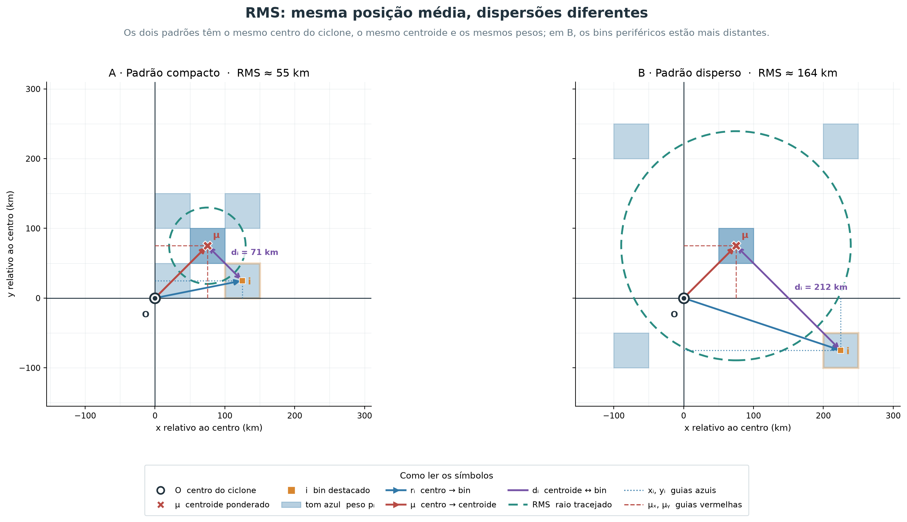
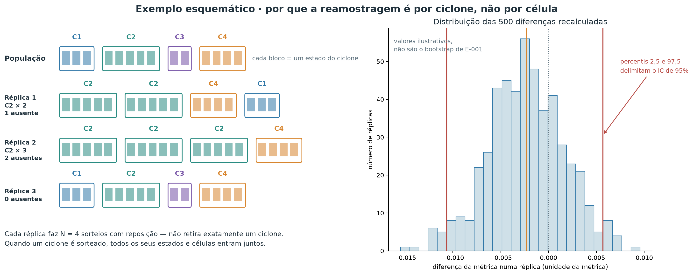

# E-001 — Orientação pelo movimento do ciclone

- **Status:** `INCONCLUSIVE`
- **Planejamento e execução:** 21 de setembro de 2026
- **Hipótese:** H2 — usar quadrantes rotacionados pelo movimento reduz a dispersão espacial das excedências em relação aos quadrantes geograficamente fixos.
- **Questões e decisões relacionadas:** [Q-007](open_questions.md#q-007--a-orientação-pelo-movimento-organiza-melhor-as-excedências) e [D-005](decisions.md#d-005--manter-aberta-a-escolha-entre-centered-e-motion-relative-após-e-001).

## Contexto

Campos de vento de ciclones diferentes podem compartilhar uma organização física e, ainda assim, parecer difusos quando são sobrepostos com o norte geográfico sempre para cima. Isso acontece se a posição preferencial dos extremos acompanha a direção de deslocamento de cada sistema. A representação de **quadrantes rotacionados pelo movimento** (*motion-relative*) gira cada estado para colocar todos os movimentos na mesma direção; a representação de **quadrantes fixos** (*centered*) apenas desloca o centro do ciclone para a origem.

Esses nomes indicam o sistema de referência, não uma divisão da análise em apenas quatro categorias. E-001 usa coordenadas contínuas e uma grade de 44 × 44 bins em ambos os casos. Os identificadores técnicos `centered` e `motion_relative` são preservados nos arquivos CSV/JSON para manter compatibilidade e rastreabilidade.

E-001 é o primeiro teste formal dessa hipótese de representação. Ele não estima *coverage probability*, *footprint* probabilístico ou hazard geográfico. O objeto comparado é mais simples: a distribuição espacial normalizada das ocorrências de excedência do q95 local.

## Pergunta

Mantendo os mesmos ciclones, estados, células, flags de excedência, pesos e bins, os quadrantes rotacionados pelo movimento concentram espacialmente as excedências q95 mais do que os quadrantes fixos?

## Hipótese

H2 previa menor entropia e menor área necessária para concentrar frações fixas do peso normalizado das ocorrências q95 nos quadrantes rotacionados. Fisicamente, esse resultado indicaria que parte da variabilidade aparente em coordenadas geográficas era apenas variabilidade de orientação entre tempestades.

## Hipóteses alternativas e explicações concorrentes

A rotação poderia não ajudar se os extremos fossem organizados sobretudo por fatores geográficos, estrutura interna variável, intensidade ou estágio do ciclone. Também poderia concentrar apenas o núcleo e dispersar a cauda, ou revelar assimetria sem reduzir a dispersão total. Perda de observações perto dos limites do suporte espacial poderia produzir uma mudança artificial; por isso o suporte foi reconstruído e diagnosticado separadamente.

## Visão geral do desenho experimental

O fluxograma abaixo resume a cadeia lógica de E-001, da pergunta à decisão. A comparação é pareada: depois de definida a população elegível, ela se divide em duas análises — quadrantes fixos e quadrantes rotacionados — que usam os mesmos bins, pesos, flags q95 e unidades amostrais. A avaliação volta a separar as perguntas feitas à distribuição, porque cada métrica descreve um aspecto diferente.

<figure class="result-figure">
  
  <figcaption>Esquema metodológico, não um resultado. Os dois braços diferem somente pela orientação e são processados com a mesma grade. Na avaliação, cada célula explicita a pergunta respondida por uma família de métricas; o bootstrap posterior reamostra ciclones inteiros de forma pareada.</figcaption>
</figure>

## Como ler o fluxo do experimento

Cada caixa do fluxograma corresponde a uma etapa científica, não a um script.

1. **Pergunta e H2.** A hipótese prevê que girar cada ciclone até alinhar seu movimento reduz a dispersão espacial das excedências.
2. **Protocolo congelado.** Threshold q95 local, bins de 50 km, peso total um por estado q95-positivo e corte de heading em 5 km/h são fixados antes de qualquer resultado.
3. **População elegível.** Os mesmos ciclones, estados, células, flags de excedência e suporte espacial alimentam as duas representações; nada é selecionado depois.
4. **Duas análises de orientação.** A mesma população alimenta dois braços distintos: análise A em quadrantes fixos e análise B em quadrantes rotacionados pelo movimento. Esta é a **única** diferença entre os braços.
5. **Grade comum.** As duas nuvens de pontos são discretizadas na mesma grade de 44 × 44 bins, sem suavização.
6. **Avaliação.** Cada distribuição é examinada por seis perguntas complementares: uniformidade dos pesos entre bins, área mínima para determinada cobertura, escala ao redor do centroide, posição média, alongamento direcional e cobertura observacional. Elas são respondidas, respectivamente, por entropia; A50/A75/A90; RMS; centroide; anisotropia; e diagnósticos de suporte.
7. **Incerteza.** Quinhentas réplicas reamostram ciclones inteiros e recalculam as diferenças de forma pareada.
8. **Decisão.** O critério preregistrado confronta métricas, fases, intervalos bootstrap e suporte, e classifica o resultado.

O fluxograma é um mapa de leitura. As seções seguintes percorrem as mesmas etapas em detalhe, começando pelos dados e pela geometria.

## Dados utilizados

A população partiu do catálogo canônico de estados ERA5 de 6 h derivado do Zenodo 18133432 e do Parquet de vento de 2010–2020. Foram elegíveis os estados no período comparável com suporte espacial — completo ou parcial — e direção de movimento confiável. Estados sem suporte não foram convertidos em zeros.

O q95 local foi fixado antes das métricas principais. A verificação prévia encontrou amostra suficiente nas quatro fases principais: 2.078 estados q95-positivos em fase incipiente, 7.301 em intensificação, 1.821 em fase madura e 4.891 em decaimento, depois do filtro de heading. Os sufixos `2`, que indicam repetição não contígua da mesma fase física, foram agrupados somente nesses quatro estratos; os resultados por rótulo literal permanecem disponíveis. A análise global inclui também estados `residual` e com fase nula; eles não foram forçados a nenhuma das quatro fases.

| Quantidade | Valor |
| --- | ---: |
| Ciclones com suporte antes do filtro de heading | 1.784 |
| Estados com suporte antes do filtro | 23.334 |
| Estados excluídos por heading < 5 km/h | 284 (1,22%) |
| Ciclones no conjunto comparável final | 1.784 |
| Estados no conjunto comparável final | 23.050 |
| Estados com ao menos uma excedência q95 | 16.921 |
| Ciclones com ao menos uma excedência q95 | 1.757 |
| Células q95 excedentes | 9.090.570 |
| Células de suporte efetivamente avaliadas | 136.177.047 |

## Representações comparadas

### Quadrantes fixos (*centered*)

Ciclones diferentes ocorrem em latitudes e longitudes diferentes. Duas excedências igualmente distantes de seus centros têm, portanto, coordenadas geográficas completamente distintas, e somá-las diretamente não faria sentido. Antes de agregar qualquer coisa entre eventos, é preciso reexpressar cada célula pela sua posição **relativa ao centro do ciclone**, medida em quilômetros. Os quadrantes fixos fazem isso e nada mais: levam o centro do ciclone à origem e mantêm o norte geográfico apontando para cima.

<ul class="method-io">
<li>latitude e longitude da célula ERA5 e do centro do ciclone, em graus</li>
<li>projeção azimutal equidistante esférica no plano tangente ao centro</li>
<li>posição <code>(x, y)</code> em km relativa ao centro, com norte para cima</li>
</ul>

A transformação tem três passos: medir a **distância** entre centro e célula, medir a **direção** em que a célula é vista do centro e converter distância e direção em coordenadas cartesianas.

Em todos eles, sejam `φ₀` e `λ₀` a latitude e a longitude do centro e `φ` e `λ` as da célula, todas em radianos; `Δλ` é `λ − λ₀` envolvida em `[-π, π)`.

**Passo 1 — distância ao centro.** Queremos saber a quantos quilômetros a célula está do centro, sobre a superfície da esfera. A distância de grande círculo usa:

$$a=\sin^2\left(\frac{\phi-\phi_0}{2}\right)+\cos\phi_0\cos\phi\sin^2\left(\frac{\Delta\lambda}{2}\right).$$

$$d=2R\operatorname{atan2}\left(\sqrt{a},\sqrt{1-a}\right), \qquad R=6\,371\ \text{km}.$$

Aqui `a` é uma quantidade auxiliar adimensional da fórmula do semiverso, `R` é o raio médio da Terra e `d` é a distância célula–centro em km, sempre não negativa.

**Passo 2 — direção da célula vista do centro.** Saber a distância não basta: duas células a 300 km do centro podem estar em lados opostos. O azimute `α`, em radianos e no sentido horário a partir do norte, indica essa direção:

$$\alpha=\operatorname{atan2}\left(\sin\Delta\lambda\cos\phi,\ \cos\phi_0\sin\phi-\sin\phi_0\cos\phi\cos\Delta\lambda\right).$$

**Passo 3 — coordenadas cartesianas.** Distância e azimute são então convertidos no par `(x, y)` que todas as etapas seguintes usam:

$$x = d\sin(\alpha), \qquad y = d\cos(\alpha).$$

`x` e `y` estão em km e podem ser positivos ou negativos: `x > 0` significa leste, `x < 0` oeste, `y > 0` norte e `y < 0` sul.

Em linguagem comum, o procedimento pergunta “a que distância e em que direção esta célula está do olho do ciclone?” e responde com um par de quilômetros em vez de um par de graus. Uma célula 300 km a leste e 300 km ao norte do centro recebe `(x, y) ≈ (300, 300)` qualquer que seja a latitude do ciclone, o que torna células de eventos diferentes comparáveis entre si.

A projeção preserva a distância radial `d` ao centro e evita tratar graus de longitude como distância cartesiana, mas é uma aproximação esférica local: distâncias **entre** duas células afastadas do centro não são preservadas com a mesma fidelidade. Como as duas representações comparadas usam exatamente a mesma projeção, esse efeito não favorece nenhuma delas.

**Saída desta etapa.** Cada célula q95 de cada estado passa a ter uma posição `(x, y)` em km relativa ao centro do seu próprio ciclone. Essa é a entrada da etapa seguinte.

### Quadrantes rotacionados pelo movimento (*motion-relative*)

Um ciclone que se desloca para leste e outro que se desloca para sul podem ter a mesma organização física — por exemplo, extremos concentrados à esquerda do movimento — e ainda assim parecer completamente diferentes num mapa com o norte sempre para cima. A hipótese H2 diz que parte da dispersão observada é apenas essa diferença de orientação. Para testá-la, giramos cada estado até que todos os ciclones estejam “andando na mesma direção”.

<ul class="method-io">
<li>posição <code>(x, y)</code> em km da etapa anterior e o heading do ciclone naquele estado</li>
<li>rotação rígida do plano até alinhar o vetor de deslocamento com o eixo vertical</li>
<li>posição <code>(x_m, y_m)</code> em km, com a frente do movimento para cima</li>
</ul>

Seja `θ` o heading do ciclone, em radianos, medido no sentido horário a partir do norte — a mesma convenção do azimute da etapa anterior. Sua estimativa é descrita na seção seguinte. A rotação usada foi:

$$\begin{bmatrix}x_m\\y_m\end{bmatrix}=\begin{bmatrix}\cos\theta&-\sin\theta\\\sin\theta&\cos\theta\end{bmatrix}\begin{bmatrix}x\\y\end{bmatrix}.$$

Aqui, `x_m` e `y_m` estão em km; `y_m > 0` é a frente do movimento, `y_m < 0` é a retaguarda, `x_m > 0` é a direita e `x_m < 0` é a esquerda.

A rotação não move nenhum ponto para longe ou para perto do centro: ela apenas redefine o que se chama de “para cima”. A distância de cada célula ao centro do ciclone é exatamente a mesma antes e depois. O que muda é o significado dos eixos: em vez de leste e norte, eles passam a significar direita e frente do movimento.

Para um ciclone que se move exatamente para leste (`θ = 90°`), leste passa a ser a frente e sul passa a ser a direita. Uma célula que estava 200 km ao sul do centro, com `(x, y) = (0, −200)`, passa a ter `(x_m, y_m) = (200, 0)`: 200 km à direita do movimento e nem à frente nem atrás. Para um ciclone que se move para o sul, a mesma célula 200 km ao sul do centro estaria 200 km à frente.

**Saída desta etapa.** Cada célula q95 passa a ter duas posições: `(x, y)` nos quadrantes fixos e `(x_m, y_m)` nos rotacionados. Todo o restante do método é aplicado de forma idêntica às duas.

O Parquet de origem contém as colunas categóricas `fixed_quadrant` e `rotated_quadrant`, que seguem essa mesma ideia. E-001, porém, não usa esses códigos de quatro categorias para calcular as métricas: transforma as posições contínuas `(x, y)` em `(x_m, y_m)` e só depois as discretiza na grade de 44 × 44 bins.

A figura esquemática mostra um ciclone movendo-se para sudeste. À esquerda, os eixos leste–oeste e norte–sul permanecem fixos; à direita, as mesmas células são giradas até o deslocamento apontar para a frente. Os pontos e suas distâncias ao centro são os mesmos nos dois painéis.

<figure class="result-figure">
  
  <figcaption>Exemplo conceitual, não um resultado de E-001. “Quadrantes fixos” e “quadrantes rotacionados” nomeiam os eixos de referência; as posições permanecem contínuas, e não são reduzidas a quatro categorias.</figcaption>
</figure>

## Estimativa da direção de movimento

A rotação da etapa anterior precisa de um número que ainda não temos: para onde cada ciclone estava indo naquele instante. O catálogo fornece apenas a posição do centro em cada horário de 6 h, então a direção precisa ser **inferida** das posições vizinhas. Isso levanta um problema prático: quando o ciclone quase não se move, a direção calculada é essencialmente ruído, e girar o campo por um ângulo arbitrário introduziria dispersão em vez de removê-la.

<ul class="method-io">
<li>posições dos centros do ciclone nos estados anterior, atual e posterior, com seus horários</li>
<li>diferença centrada no plano tangente local, seguida de filtro de velocidade mínima</li>
<li>heading <code>θ</code> em radianos e velocidade de translação <code>s</code> em km/h, ou exclusão do estado</li>
</ul>

**Passo 1 — de onde vem a informação.** O heading foi calculado exclusivamente do catálogo completo de estados, nunca das linhas de excedência. Usar apenas os estados com excedência produziria uma direção estimada a partir do próprio subconjunto sob análise.

**Passo 2 — o cálculo.** Para estados internos de uma track, sejam `r₋ = (x₋, y₋)` e `r₊ = (x₊, y₊)` os centros anterior e posterior projetados, em km, no plano tangente do estado atual, e `t₋`, `t₊` seus horários, em horas. O vetor e o heading são:

$$\mathbf{v}=\frac{\mathbf{r}_{+}-\mathbf{r}_{-}}{t_{+}-t_{-}}, \qquad s=\sqrt{v_x^2+v_y^2}, \qquad \theta=\operatorname{atan2}(v_x,v_y).$$

`vₓ` é a componente leste e `vᵧ`, a componente norte, ambas em km/h; `s` é a velocidade de translação em km/h, sempre não negativa; `θ` está em `[-π, π]`, medido no sentido horário a partir do norte. Nas extremidades, `r₋` ou `r₊` é substituído pelo próprio estado para formar uma diferença simples de 6 h; nos estados internos, a diferença é centrada em 12 h.

Em linguagem comum, a direção do ciclone num dado instante é estimada traçando uma seta do ponto onde ele estava 6 h antes até onde estará 6 h depois. Quanto mais longa essa seta, mais confiável é sua direção; quanto mais curta, mais o ângulo é dominado por ruído de posicionamento do centro.

**Passo 3 — descartar direções não confiáveis.** A distribuição foi examinada antes das métricas de concentração. A mediana foi 42,68 km/h, o percentil 1 foi 4,55 km/h e a faixa observada foi 0,31–150,89 km/h. O critério de confiabilidade foi fixado em 5 km/h, equivalente a 30 km em 6 h e aproximadamente uma célula da grade original de 0,25°. Diferentemente do procedimento exploratório herdado, movimentos menores não receberam heading leste artificial.

<figure class="result-figure">
  
  <figcaption>Distribuição usada para auditar o corte de heading. A linha vermelha marca 5 km/h; 284 de 23.334 estados com suporte ficaram abaixo do corte.</figcaption>
</figure>

## Método

As duas representações usaram exatamente os mesmos 23.050 estados, as mesmas células, as mesmas flags q95 e uma grade de 44 × 44 bins de 50 km no domínio `[-1.100, 1.100] km` em cada eixo. Não houve suavização nem máscara mínima de cobertura na análise principal. Cada estado q95-positivo recebeu peso estatístico total igual a um, dividido igualmente entre suas células excedentes. Esse “peso” não é massa física nem magnitude do vento: é apenas a contribuição normalizada do estado para a distribuição espacial. Estados sem q95 permaneceram nas contagens e na auditoria de suporte, mas não definem posição numa distribuição condicionada à ocorrência.

O mapa agregado é, portanto, a distribuição normalizada das ocorrências q95 depois de atribuir o mesmo peso a cada estado q95-positivo. Ciclones mais duradouros ainda podem contribuir com mais estados; resolver *equal-time* versus *equal-cyclone* está fora de E-001.

O restante desta seção percorre duas transformações, nesta ordem: primeiro as posições contínuas viram **bins**; depois cada estado distribui seu peso entre os bins que ocupa. Os quatro níveis do projeto aparecem aqui encadeados:

> ciclone (`track_id`) → estado ciclone–tempo → célula ERA5 → bin de 50 km

Em E-001, **o nível que recebe peso é o estado**: cada estado q95-positivo vale um. O nível agregado é o bin. O nível que serve de unidade inferencial no bootstrap é o ciclone. Manter os três separados é essencial para ler corretamente as métricas.

### Discretização espacial e definição dos bins

Depois da transformação de coordenadas, cada célula q95 é um ponto solto em quilômetros. Pontos soltos não podem ser comparados entre representações: seria preciso decidir quando duas posições “são o mesmo lugar”. A discretização resolve isso cobrindo o plano com quadrados de tamanho fixo e perguntando apenas em qual quadrado cada ponto caiu.

<ul class="method-io">
<li>posições contínuas <code>(x, y)</code> ou <code>(x_m, y_m)</code> em km, de todas as células q95</li>
<li>atribuição de cada posição a um quadrado de 50 km, sem interpolação</li>
<li>índice de bin <code>B_jk</code> para cada célula, numa grade comum de 44 × 44</li>
</ul>

Um *bin* é uma célula quadrada usada para reunir as células ERA5 localizadas numa mesma região do sistema de coordenadas relativo. A grade foi fixada antes do cálculo das métricas: 50 km de lado, 44 bins por eixo e 1.936 bins possíveis no quadrado de `2.200 × 2.200 km`. Em notação explícita, as linhas que separam os bins são

$$e_j=-1\,100+50j, \qquad j=0,\ldots,44,$$

e cada bin é

$$B_{jk}=[e_j,e_{j+1})\times[e_k,e_{k+1}), \qquad j,k=0,\ldots,43.$$

Neste texto, três tipos de limite precisam ser distinguidos:

- **divisões internas dos bins:** linhas a cada 50 km que separam um quadrado do seguinte;
- **limite externo da grade:** o quadrado definido por `x = ±1.100 km` e `y = ±1.100 km`;
- **limite radial do suporte:** o círculo de raio 1.100 km ao redor do ciclone. Bins nos cantos do quadrado ficam fora desse círculo e, por construção, não recebem células avaliadas.

O último bin de cada eixo inclui o limite `+1.100 km`, para não perder valores exatamente nesse ponto. Na implementação, uma tolerância numérica de `10⁻⁶ km` é aceita nos quatro limites externos; valores dentro dessa tolerância são associados ao primeiro ou ao último bin, e valores além dela são descartados. A posição de cada célula ERA5, depois da transformação de coordenadas, determina um único `B_jk`. Não há interpolação, suavização ou redistribuição entre bins vizinhos.

O protocolo congelou o lado de 50 km como compromisso entre resolução e estabilidade. A grade ERA5 de `0,25°` representa aproximadamente 28 km no sentido norte–sul e cerca de 20–27 km no sentido zonal nas latitudes da amostra; assim, um bin de 50 km costuma conter apenas algumas células ERA5 de um estado individual. Quando milhares de estados são agregados, o mesmo bin acumula contribuições de muitos estados. Não foi feita uma busca entre várias resoluções nem uma análise de sensibilidade dos bins em E-001.

A figura abaixo mostra primeiro a grade completa. As 44 colunas multiplicadas pelas 44 linhas produzem 1.936 bins; o círculo tracejado mostra o suporte radial efetivamente possível. O segundo painel amplia seis bins ocupados por um estado real elegível. Cada ponto laranja é uma célula ERA5 que excedeu q95 naquele estado — não uma observação inventada.

<figure class="result-figure">
  
  <figcaption>Escala real da discretização. No estado em intensificação do ciclone 20100059 em 22 de janeiro de 2010 às 12 UTC, 15 células q95 ocuparam seis bins; cada ponto contribuiu com 1/15 = 6,67% do peso desse estado. No experimento completo, 1.600 dos 1.936 bins tiveram ao menos uma célula q95 entre os 16.921 estados q95-positivos. Os bins restantes ficam principalmente nos cantos externos ao suporte circular.</figcaption>
</figure>

### Peso por estado e distribuição espacial

Neste ponto sabemos em que bin caiu cada célula excedente, mas ainda não sabemos quanto cada estado deve contar no mapa final. Se simplesmente contássemos células, um estado com 2.000 células excedentes dominaria 100 estados com 20 células cada — e a diferença entre eles é sobretudo o tamanho da área afetada, não a importância do evento. A decisão de E-001 é dar a **cada estado q95-positivo o mesmo peso total**, e deixar que apenas a *distribuição interna* desse peso varie.

<ul class="method-io">
<li>índices de bin de todas as células q95, agrupados por estado</li>
<li>peso total um por estado, repartido entre suas células, e soma sobre todos os estados</li>
<li>distribuição espacial normalizada <code>p_i</code>, uma proporção por bin, somando um</li>
</ul>

A construção tem três passos: repartir o peso **dentro** de um estado, somar os estados e normalizar o total.

**Passo 1 — repartir o peso dentro de um estado.** Para um estado `s` e um bin `i`, definem-se explicitamente:

$$n_{si}=\text{número de células q95 do estado }s\text{ localizadas no bin }i,$$

$$N_s=\sum_i n_{si}=\text{número total de células q95 do estado }s.$$

Aqui `n_si` e `N_s` são contagens adimensionais de células, com `N_s ≥ 1` em todo estado q95-positivo. O peso que o estado `s` atribui ao bin `i` é

$$w_{si}=\frac{n_{si}}{N_s}, \qquad \sum_i w_{si}=1.$$

`w_si` é adimensional e está entre 0 e 1.

Esta é a única equação que define “peso igual por estado”. Ela diz que o estado inteiro vale uma unidade e que essa unidade é repartida entre os bins na proporção das células excedentes que cada bin recebeu. Um estado com 20 células e outro com 2.000 têm o mesmo peso total; o que muda é o detalhe com que esse peso se espalha.

**Passo 2 — somar os estados.** Somando as contribuições de todos os estados q95-positivos, obtém-se o peso agregado do bin,

$$W_i=\sum_s w_{si},$$

onde `W_i` é adimensional e vale, no máximo, o número de estados q95-positivos.

**Passo 3 — normalizar.** `W_i` depende do tamanho da amostra, então primeiro somamos os pesos agregados dos 1.936 bins. Chamamos esse resultado de **peso agregado total da grade**, `W_total`:

$$W_{\mathrm{total}}=\sum_{i=1}^{1\,936}W_i.$$

`W_total` é adimensional e reúne todo o peso produzido pelos estados q95-positivos. Para obter a proporção espacial final de um bin `i`, dividimos o peso agregado desse bin pelo peso total da grade:

$$p_i=\frac{W_i}{W_{\mathrm{total}}}, \qquad \sum_{i=1}^{1\,936}p_i=1.$$

`p_i` é adimensional e está entre 0 e 1.

Portanto, `p_i = 0,02` significa que o bin contém 2% do peso estatístico normalizado de todas as ocorrências q95. Não significa 2% da massa de ar, 2% da velocidade do vento nem necessariamente 2% das células brutas.

**Saída desta etapa.** Um vetor de 1.936 proporções por representação. Todas as métricas da próxima seção são calculadas exclusivamente a partir desse vetor.

#### Exemplo com um estado real

O estado mostrado na figura anterior, `track_id = 20100059` em `2010-01-22 12:00 UTC`, estava em intensificação, tinha suporte completo e 15 células q95:

$$N_s=15, \qquad \frac{1}{N_s}=\frac{1}{15}=0{,}0667.$$

Cada célula vale, portanto, 6,67% do peso desse estado. Os seis bins receberam:

| Centro do bin `(x, y)`, km | `n_si` | Cálculo de `w_si` | Peso do estado no bin |
| --- | ---: | ---: | ---: |
| `(225, −325)` | 4 | `4/15` | 26,67% |
| `(175, −275)` | 4 | `4/15` | 26,67% |
| `(275, −325)` | 3 | `3/15` | 20,00% |
| `(225, −275)` | 2 | `2/15` | 13,33% |
| `(175, −325)` | 1 | `1/15` | 6,67% |
| `(325, −275)` | 1 | `1/15` | 6,67% |

Por exemplo,

$$w_{s,(225,-325)}=\frac{4}{15}=0{,}2667,$$

e a verificação da normalização é

$$\sum_i w_{si}=\frac{4+4+3+2+1+1}{15}=\frac{15}{15}=1.$$

Consequentemente, um estado com 20 células excedentes e outro com 2.000 têm o mesmo peso total igual a um; apenas a distribuição espacial desse peso muda. Estados sem nenhuma célula q95 não entram em `p_i`, pois não têm posição numa distribuição condicionada à excedência, mas continuam contabilizados na auditoria da população e do suporte. Como a ponderação é por estado e não por ciclone, sistemas com mais estados q95-positivos ainda podem contribuir mais vezes.

O exemplo seguinte isola apenas o comportamento da entropia. É uma grade esquemática de 4 × 4 — não a grade real de 44 × 44 — e as cores mais escuras indicam maior proporção `p_i` do peso normalizado.

<figure class="result-figure">
  
  <figcaption>Exemplo esquemático, não um resultado de E-001 e não uma representação da resolução real. Em A, um bin concentra 70% do peso; em B, quatro bins recebem 25% cada. A entropia aumenta porque as proporções ficam mais uniformes; ela não mede a distância física entre os bins.</figcaption>
</figure>

## Métodos de avaliação e métricas

Nenhuma métrica isolada descreve simultaneamente núcleo, cauda, escala, posição e forma. Por isso E-001 combinou medidas complementares, todas calculadas a partir da mesma distribuição `p_i`. As métricas primárias de decisão foram entropia e áreas de concentração; RMS, centroide, covariância e suporte ajudaram a explicar eventuais diferenças.

### Entropia espacial

**Problema que resolve.** É necessário resumir em um único número quão espalhado está o peso normalizado das ocorrências q95 pelos bins, sem escolher previamente um centro ou uma direção preferencial.

**Cálculo.** Para os bins com `p_i > 0`, a entropia de Shannon é

$$H = -\sum_i p_i\log(p_i), \qquad \sum_i p_i = 1.$$

Foi usado o logaritmo natural; portanto, a unidade é o *nat*. Bins vazios contribuem zero pelo limite de `p log(p)`. Se `K` bins têm `p_i > 0`, `H` varia entre zero — todo o peso em um único bin — e `ln(K)` — peso perfeitamente uniforme entre os `K` bins.

**Como interpretar.** Na mesma grade, menor `H` significa maior concentração global. A diferença reportada é

$$\Delta H=H_{\text{rotacionados}}-H_{\text{fixos}}.$$

Valor negativo favorece os quadrantes rotacionados; valor positivo favorece os quadrantes fixos.

**O que não mede.** A entropia não informa **onde** o peso está, não distingue núcleo de cauda e não diz se os bins ocupados formam uma região conectada: permutar os mesmos valores entre bins distantes não altera `H`. Ela também depende do tamanho dos bins; por isso a resolução foi congelada e mantida igual nas duas representações.

**Exemplo didático.** Na figura anterior, a distribuição compacta atribui pesos `[0,70; 0,10; 0,10; 0,10]` e tem `H = 0,940 nat`; a distribuição uniforme atribui `0,25` a cada um de quatro bins e tem `H = 1,386 nat`. O peso total é idêntico, mas a segunda distribuição é mais uniforme. Se os mesmos quatro valores fossem apenas deslocados para outras posições, `H` não mudaria. Esses valores apenas ilustram o cálculo e não entram nos resultados de E-001.

### Área mínima de cobertura Aq: A50, A75 e A90

**Pergunta que responde.** Qual é a menor área da grade capaz de reunir uma proporção previamente escolhida do peso espacial? Duas distribuições podem ter entropias parecidas e ainda exigir áreas muito diferentes para conter seu núcleo ou sua cauda.

**Intuição e origem da métrica.** Procuramos primeiro os bins com maior `p_i` e perguntamos quantos deles são necessários para alcançar uma cobertura-alvo. Essa construção é a versão discreta, restrita a uniões de bins de área igual, de uma **região de maior densidade** (*highest-density region*, HDR) ou **conjunto de volume mínimo**: entre as regiões com determinada cobertura probabilística, busca-se a de menor volume ou área. A base conceitual é descrita por [Hyndman (1996)](https://doi.org/10.1080/00031305.1996.10474359) para regiões de maior densidade e por [Polonik (1997)](https://doi.org/10.1016/S0304-4149(97)00028-8) para conjuntos de volume mínimo. A notação `A_q` é adotada neste projeto; não é uma sigla universal desses artigos.

**O que significa `q`.** `q` é a **proporção-alvo de cobertura**, escolhida antes do cálculo, e não a área medida. É adimensional e satisfaz `0 < q ≤ 1`. Neste experimento:

- em `A50`, `q = 0,50`: queremos reunir pelo menos 50% do peso;
- em `A75`, `q = 0,75`: queremos reunir pelo menos 75%;
- em `A90`, `q = 0,90`: queremos reunir pelo menos 90%.

Assim, `A50` é exatamente `A_q` avaliada em `q = 0,50`; o mesmo padrão vale para `A75` e `A90`.

O símbolo `A` representa a **área resultante**, em km². Portanto, a proporção `q` fixa quanto peso deve ser coberto, enquanto `A_q` mede quanta área é necessária para atingir essa cobertura.

**Cálculo verbal.** Ordenamos os 1.936 bins do maior para o menor `p_i`. Em seguida, somamos esses valores nessa ordem até a soma alcançar ou ultrapassar `q`. O número de bins utilizados é multiplicado por `2.500 km²`, a área de um bin de 50 × 50 km.

**Formalização.** `p_(r)` é a proporção do bin que ocupa a posição `r` no ranking decrescente:

$$p_{(1)}\ge p_{(2)}\ge\cdots\ge p_{(1\,936)}.$$

O número mínimo de bins necessário para alcançar a cobertura `q` é `k_q`:

$$k_q=\min\left\{k:\sum_{r=1}^{k}p_{(r)}\ge q\right\}.$$

Como a área de cada bin é `a_bin = 50 × 50 = 2.500 km²`, a área mínima de cobertura na grade é

$$A_q=k_q\,a_{\mathrm{bin}}=k_q\times 2\,500\ \text{km}^2.$$

Aqui, `r` é somente a posição do bin no ranking; `k` é um número candidato de bins entre 1 e 1.936; `k_q` é o menor desses números que alcança `q`; e `A_q` tem unidade de km². O último bin é contado por inteiro, mesmo que apenas parte de seu peso seja necessária para ultrapassar `q`; não há interpolação fracionária.

**Por que a área é mínima na grade?** Para qualquer número fixo `k`, escolher os `k` maiores valores de `p_i` produz a maior cobertura possível com `k` bins. Se nem esses `k` bins alcançam `q`, nenhuma outra escolha de `k` bins alcançará. Portanto, o primeiro `k_q` que atinge a meta usa o menor número possível de bins — e, como todos têm a mesma área, também a menor área possível dentro dessa grade.

**Exemplo simples.** Se os pesos ordenados começarem com `0,30`, `0,20`, `0,15` e `0,10`, então `A50` usa os dois primeiros bins, pois `0,30 + 0,20 = 0,50`: logo, `k_q = 2` para `q = 0,50` e `A50 = 2 × 2.500 = 5.000 km²`. Para `A75`, os quatro primeiros bins acumulam `0,75`, então `A75 = 10.000 km²`.

**Como interpretar.** Para o mesmo `q` e a mesma grade, menor `A_q` indica maior concentração naquela faixa da distribuição. `A50` resume o núcleo de maior peso, `A75` inclui uma parcela intermediária e `A90` alcança regiões de menor peso, sendo mais sensível à cauda espacial. Para

$$\Delta A_q=A_{q,\text{rotacionados}}-A_{q,\text{fixos}},$$

valores negativos favorecem os quadrantes rotacionados.

**O que não mede.** `A_q` não é, nesta implementação, a área de um polígono contínuo nem uma HDR contínua estimada por suavização. É o mínimo exato apenas dentro da classe de conjuntos formados por bins inteiros da grade. Os bins selecionados não precisam ser vizinhos; a métrica não informa a posição, a conectividade ou a forma da região e varia em passos discretos de `2.500 km²`. Sua validade para a comparação depende de manter a mesma grade e o mesmo `q` nas duas orientações.

No exemplo abaixo, as barras mostram pesos hipotéticos já ordenados e a linha mostra sua proporção acumulada. As linhas horizontais marcam os três alvos; os eixos representam posição no ranking e peso, não distância espacial.

<figure class="result-figure">
  
  <figcaption>Exemplo didático, não um resultado de E-001. Com pesos ordenados de 0,30, 0,20, 0,15, 0,10, 0,10, 0,05, 0,05 e 0,05, obtêm-se A50 = 5.000 km², A75 = 10.000 km² e A90 = 15.000 km².</figcaption>
</figure>

### Dispersão RMS em torno do centroide

**Pergunta que responde.** A que distância típica do seu próprio centro espacial está distribuído o peso normalizado das ocorrências q95? Entropia e `A_q` descrevem uniformidade entre bins e área necessária para determinada cobertura, mas nenhuma delas fornece diretamente uma escala de dispersão em quilômetros.

**Intuição e origem da métrica.** Para cada bin, medimos a distância entre o centro do bin e o centroide ponderado de toda a distribuição. Elevamos essas distâncias ao quadrado, calculamos sua média ponderada por `p_i` e extraímos a raiz quadrada. Por isso a sigla **RMS** significa *root mean square*, ou **raiz da média dos quadrados**. Em análise espacial, a mesma construção é conhecida como **distância padrão ponderada** (*weighted standard distance*), uma medida centrográfica de dispersão ao redor do centro médio; sua formulação clássica é discutida por [Bachi (1962)](https://doi.org/10.1111/j.1435-5597.1962.tb00872.x). O nome “RMS ao redor do centroide” foi usado em E-001 para deixar explícita a operação realizada; não designa uma nova métrica criada pelo projeto.

**Objetos e símbolos.** O índice `i` percorre os 1.936 bins da grade. Para cada distribuição e cada bin:

- `O = (0, 0)` é a origem do sistema relativo: o centro do ciclone. Como todos os estados foram centralizados antes da agregação, seus centros coincidem nessa origem comum;
- `r_i = (x_i, y_i)` é o **vetor posição** que vai da origem `O` até o centro geométrico do bin `i`, em quilômetros. `x_i` e `y_i` são as **componentes escalares assinadas** desse vetor: não são dois vetores nem duas distâncias sempre positivas. Nos quadrantes fixos, `x_i` representa leste–oeste e `y_i`, norte–sul; nos quadrantes rotacionados, representam direita–esquerda e frente–retaguarda. O vetor `r_i` aponta para o centro do bin, não para uma célula ERA5 individual nem para a média das células que caíram nele;
- `p_i` é a proporção adimensional do peso normalizado de ocorrências atribuída ao bin `i`, com `0 ≤ p_i ≤ 1` e `Σ_i p_i = 1`. Bins vazios têm `p_i = 0` e não alteram o cálculo;
- `μ = (μ_x, μ_y)` é o **vetor deslocamento do centroide**, da origem `O` até o centroide ponderado da distribuição. `μ_x` e `μ_y` são suas componentes escalares assinadas, em quilômetros; somente o par forma o vetor. O centroide é a posição média dos centros dos bins quando cada bin é ponderado por `p_i`; ele pode cair entre bins e não precisa coincidir com o centro de nenhum deles;
- `d_μ = ||μ|| = √(μ_x² + μ_y²)` é a distância escalar, sempre não negativa, entre o centro do ciclone e o centroide;
- `d_i` é a distância euclidiana, em quilômetros, entre o centro do bin `i` e o centroide.

Portanto, a sua interpretação está correta quando aplicada ao **par**: o vetor `μ` descreve o deslocamento do centro do ciclone até o centroide. O que precisava ser corrigido é que `μ_x` e `μ_y`, isoladamente, são componentes desse vetor, não vetores de distância independentes.

Embora o esquema abaixo mostre um ciclone na origem para tornar a geometria concreta, a RMS de E-001 **não é calculada separadamente para um estado `s`**. Cada estado contribui para `p_i`, mas o centroide e a RMS são calculados depois da agregação de todos os estados elegíveis. Desenhar o padrão como se pertencesse a um único estado real sugeriria uma unidade de cálculo incorreta. Nos dois painéis, os eixos estão em quilômetros, as cores representam pesos `p_i` hipotéticos e a origem é o centro comum dos ciclones após a centralização. O contorno laranja destaca um bin `i`; a seta azul é `r_i`, a vermelha é `μ`, o segmento roxo é `d_i` e o círculo tracejado tem raio igual à RMS.

<figure class="result-figure">
  
  <figcaption>Esquema metodológico, não um resultado de E-001 nem a representação de um estado real. Os dois padrões usam o mesmo centro do ciclone, o mesmo centroide e os mesmos pesos hipotéticos; apenas a distância dos bins periféricos ao centroide muda. No painel compacto, RMS ≈ 55 km; no disperso, RMS ≈ 164 km. A figura separa o vetor <code>r_i = (x_i, y_i)</code>, o vetor <code>μ = (μ_x, μ_y)</code>, a distância centro–centroide <code>d_μ</code> e a distância bin–centroide <code>d_i</code>.</figcaption>
</figure>

**Cálculo verbal.** Primeiro calculamos a posição média ponderada da distribuição. Depois calculamos a distância de cada centro de bin até essa posição. Por fim, fazemos a média ponderada dos quadrados dessas distâncias e extraímos a raiz quadrada.

**Passo 1 — calcular o centroide.** O vetor do centro do ciclone até o centroide é a média ponderada dos vetores posição dos bins:

$$\boldsymbol{\mu}=\sum_i p_i\mathbf{r}_i
=\begin{bmatrix}\mu_x\\\mu_y\end{bmatrix}.$$

Suas duas componentes escalares são

$$\mu_x=\sum_i p_i x_i, \qquad \mu_y=\sum_i p_i y_i.$$

Em linguagem comum, cada centro de bin “puxa” o centroide na proporção do peso `p_i` que recebeu.

**Passo 2 — calcular a distância de cada bin ao centroide.** Para o bin `i`,

$$d_i=\lVert\mathbf{r}_i-\boldsymbol{\mu}\rVert
=\sqrt{(x_i-\mu_x)^2+(y_i-\mu_y)^2}.$$

`d_i` é não negativa e está em quilômetros. Ela vale zero somente se o centro do bin coincidir com o centroide.

**Passo 3 — calcular a distância RMS.** Como os pesos `p_i` somam um, `Σ_i p_i d_i^2` é a média ponderada das distâncias quadradas. A métrica final é

$$\operatorname{RMS}=\sqrt{\sum_i p_i d_i^2}
=\sqrt{\sum_i p_i\left[(x_i-\mu_x)^2+(y_i-\mu_y)^2\right]}.$$

A quantidade dentro da raiz tem unidade de km²; depois da raiz, a RMS é expressa em quilômetros. A RMS é sempre não negativa e vale zero apenas quando todo o peso está concentrado em um único bin. Seu limite superior depende do domínio e do suporte usados, portanto não existe um limiar universal que separe uma distribuição “compacta” de uma “dispersa”.

**Exemplo simples.** Considere três bins reais possíveis da grade de 50 km, mas com pesos hipotéticos:

| Bin `i` | Centro `(x_i, y_i)`, km | `p_i` | `d_i²`, km² | `p_i d_i²`, km² |
| --- | ---: | ---: | ---: | ---: |
| 1 | `(−25, −25)` | 0,25 | 2.031,25 | 507,8125 |
| 2 | `(+25, −25)` | 0,25 | 781,25 | 195,3125 |
| 3 | `(+25, +25)` | 0,50 | 781,25 | 390,6250 |

Primeiro, o centroide é

$$\mu_x=0{,}25(-25)+0{,}25(25)+0{,}50(25)=12{,}5\ \text{km},$$

$$\mu_y=0{,}25(-25)+0{,}25(-25)+0{,}50(25)=0\ \text{km}.$$

Por exemplo, para o primeiro bin, `d_1² = (−25 − 12,5)² + (−25 − 0)² = 2.031,25 km²`. Repetindo para os três bins, a média ponderada das distâncias quadradas é `1.093,75 km²`; portanto,

$$\operatorname{RMS}=\sqrt{1\,093{,}75}=33{,}07\ \text{km}.$$

Esse valor diz que a escala quadrática típica da distribuição ao redor de seu centroide é `33,07 km`. Os números são apenas didáticos e não são um resultado de E-001.

**Como interpretar.** Mantidos a grade, o suporte e a ponderação, menor RMS significa que o peso está mais próximo de seu próprio centroide; maior RMS significa maior dispersão radial. Como as distâncias são elevadas ao quadrado, uma pequena proporção de peso muito distante pode aumentar a RMS de forma relevante. A comparação de E-001 usa

$$\Delta\operatorname{RMS}=\operatorname{RMS}_{\text{rotacionados}}-\operatorname{RMS}_{\text{fixos}}.$$

Valor negativo favorece os quadrantes rotacionados; valor positivo favorece os quadrantes fixos.

**O que não mede.** A RMS não mede a distância ao centro do ciclone: ela usa como referência o **centroide da própria distribuição**, que pode estar deslocado da origem. Também não informa qual proporção do peso está dentro de um círculo de raio RMS; esse círculo não é equivalente a `A50`, `A75` ou `A90` e não possui cobertura probabilística fixa. A RMS não distingue direções, forma, conectividade ou multimodalidade — uma nuvem alongada e uma circular podem ter a mesma RMS — e não localiza o padrão. Como se usam centros de bins, cada posição é aproximada pelo centro do quadrado que a contém, com deslocamento posicional máximo de meia diagonal do bin, aproximadamente `35,4 km`; a comparação pareada na mesma grade limita, mas não elimina, essa discretização.

### Centroide e deslocamento do padrão

**Problema que resolve.** Uma rotação pode deslocar a posição média do padrão sem torná-lo mais ou menos concentrado. O centroide separa localização de dispersão.

**Cálculo.** Como na definição da RMS, `i` percorre os bins, `r_i = (x_i, y_i)` é o vetor posição do centro geométrico do bin `i` e `p_i` é sua proporção do peso normalizado. O vetor deslocamento do centroide é `μ = (μ_x, μ_y)`; `μ_x` e `μ_y` são suas componentes escalares, e sua magnitude `d_μ` é a distância entre a origem — o centro do ciclone — e o centroide:

$$\boldsymbol{\mu}=\sum_i p_i\mathbf{r}_i
=\begin{bmatrix}\mu_x\\\mu_y\end{bmatrix},
\qquad d_\mu=\lVert\boldsymbol{\mu}\rVert=\sqrt{\mu_x^2+\mu_y^2}.$$

**Como interpretar.** `μ` informa simultaneamente direção e deslocamento do centroide em relação ao centro do ciclone; `d_μ`, em km, informa apenas o tamanho desse deslocamento. Nos quadrantes fixos, os sinais de `μ_x` e `μ_y` indicam leste–oeste e norte–sul; nos quadrantes rotacionados, indicam direita–esquerda e frente–retaguarda.

**O que não mede.** O centroide não mede concentração: um valor próximo de zero significa apenas equilíbrio médio em torno da origem e é compatível tanto com uma nuvem compacta quanto com duas concentrações opostas que se cancelam.

### Covariância espacial e anisotropia

**Problema que resolvem.** RMS resume a escala total, mas não distingue uma nuvem aproximadamente circular de uma nuvem alongada. A matriz de covariância descreve a dispersão por direção.

**Cálculo.**

$$\mathbf{C}=\sum_i p_i
\begin{bmatrix}x_i-\mu_x\\y_i-\mu_y\end{bmatrix}
\begin{bmatrix}x_i-\mu_x&y_i-\mu_y\end{bmatrix}.$$

Se `λ₁ ≥ λ₂` são os autovalores de `C`, a razão de anisotropia é

$$\rho=\sqrt{\frac{\lambda_1}{\lambda_2}}.$$

**Como interpretar.** `ρ = 1`, adimensional, corresponde a segundos momentos iguais nas duas direções; valores maiores indicam alongamento mais forte ao longo do autovetor principal. A direção desse autovetor identifica o eixo dominante.

**O que não mede.** A métrica resume somente segundos momentos. Ela não demonstra que a distribuição seja elíptica, unimodal ou conectada, e não distingue um alongamento genuíno de duas concentrações separadas alinhadas na mesma direção.

A figura seguinte reúne RMS, centroide e anisotropia numa nuvem hipotética. Os eixos são coordenadas relativas em quilômetros; o ponto laranja é o centroide, o círculo tracejado representa a escala RMS e a elipse resume a covariância.

<figure class="result-figure">
  
  <figcaption>Exemplo didático, não um resultado de E-001. O centroide descreve posição, o raio RMS descreve escala ao redor desse centroide e a razão entre os eixos principais descreve alongamento; nenhuma dessas quantidades substitui as demais.</figcaption>
</figure>

### Métricas de suporte

**Problema que resolvem.** A rotação pode alterar quais regiões do domínio têm células efetivamente observadas, principalmente perto do limite radial ou dos limites geográficos da base ERA5 disponível. Uma aparente concentração q95 poderia, portanto, ser apenas mudança de suporte.

**Cálculo e interpretação.** As mesmas operações de binning e entropia foram aplicadas às 136.177.047 células avaliadas, independentemente de excederem q95. Também foram registrados, por bin e representação, estados elegíveis, estados com suporte, células avaliadas e excedências. Mudança q95 acompanhada por mudança semelhante no suporte seria um alerta contra interpretação física; mudança q95 sem equivalente no suporte é menos compatível com artefato de cobertura.

**O que não mede.** O diagnóstico de suporte indica se a cobertura observacional mudou junto com o sinal q95, mas não prova ausência de artefato: ele não corrige viés de seleção da amostra nem avalia a qualidade da estimativa local de q95.

### Comparação pareada e incerteza

As métricas acima produzem um número por representação, e a diferença entre elas é o resultado do experimento. Falta saber se essa diferença é estável: ela apareceria de novo com outro conjunto de ciclones, ou depende de quais eventos entraram na amostra? O bootstrap responde a isso reconstruindo a amostra muitas vezes e observando quanto a diferença varia.

<ul class="method-io">
<li>os 1.784 ciclones elegíveis, cada um com todos os seus estados e células</li>
<li>500 reamostragens com reposição no nível do ciclone, com recálculo pareado das métricas</li>
<li>uma distribuição de 500 diferenças por métrica, resumida pelos percentis 2,5 e 97,5</li>
</ul>

**Qual é a unidade de reamostragem.** O sorteio é feito sobre `track_id`, não sobre estados nem sobre células. Cada ciclone sorteado entra inteiro: todos os seus estados e todas as suas células acompanham o sorteio. Se o mesmo `track_id` sai duas vezes, sua contribuição conta em dobro; ciclones não sorteados ficam de fora daquela réplica.

Com uma população reduzida a quatro ciclones `C1 C2 C3 C4`, uma réplica poderia ser `C2 C2 C4 C1`. Nessa réplica, `C3` não participa e `C2` entra duas vezes, com todos os seus estados nas duas vezes. As métricas são recalculadas sobre essa população reconstruída e a diferença rotacionados − fixos é armazenada. Repetindo 500 vezes, obtém-se uma distribuição de diferenças; seus percentis 2,5 e 97,5 formam o intervalo de 95%.

<figure class="result-figure">
  
  <figcaption>Esquema metodológico, não um resultado de E-001. À esquerda, a reamostragem mantém juntos todos os estados de cada ciclone sorteado; à direita, o histograma é ilustrativo e apenas mostra como os percentis 2,5 e 97,5 delimitam o intervalo. Os valores de E-001 estão nas tabelas de resultados.</figcaption>
</figure>

**Por que não reamostrar células.** As 9.090.570 células excedentes não são observações independentes: células vizinhas do mesmo estado pertencem ao mesmo campo de vento, e estados sucessivos do mesmo ciclone descrevem o mesmo sistema em instantes próximos. Reamostrar células trataria essa dependência como informação nova e produziria intervalos artificialmente estreitos. O ciclone é o nível em que as observações podem ser consideradas aproximadamente trocáveis.

**Por que a comparação é pareada.** Todas as diferenças seguem a convenção `quadrantes rotacionados − quadrantes fixos`, armazenada nos produtos como `motion_relative − centered`. Em cada réplica, exatamente as mesmas multiplicidades de ciclones são usadas nas duas orientações; `p_i` e todas as métricas são recalculados dentro da réplica, e só então a diferença é obtida. Assim, a variação entre réplicas reflete a troca de ciclones, e não uma diferença de amostra entre os dois braços.

O intervalo expressa variação entre ciclones da amostra. Ele **não** corrige viés de seleção, **não** mede a incerteza da estimativa local de q95, **não** cobre a escolha da resolução dos bins e **não** substitui validação em ciclones fora da amostra.

## Em resumo: o que este método faz?

Cada estado de ciclone com pelo menos uma excedência q95 é reexpresso em quilômetros relativos ao seu próprio centro, de duas maneiras: mantendo o norte para cima e girando até que o movimento aponte para a frente. As posições resultantes são jogadas numa grade comum de quadrados de 50 km. Cada estado contribui com a mesma quantidade total de peso, repartida entre os quadrados que suas células excedentes ocuparam, e a soma sobre todos os estados é normalizada para formar uma distribuição espacial. As mesmas seis métricas descrevem essa distribuição nas duas representações, e a diferença entre elas é o resultado do experimento. Reamostrar ciclones inteiros 500 vezes indica quanto dessa diferença sobreviveria a outra seleção de eventos.

## Critério de decisão

Antes dos resultados, evidência a favor dos quadrantes rotacionados exigia conjuntamente: entropia e A75 menores com intervalos bootstrap pareados de 95% inteiramente abaixo de zero; A50 e A90 no mesmo sentido; pelo menos três das quatro fases no mesmo sentido; menos de 10% de perda por heading; e ausência de mudança comparável na distribuição do suporte. O padrão simétrico favoreceria os quadrantes fixos. Qualquer combinação restante seria inconclusiva. Não foi exigido um tamanho de efeito mínimo arbitrário.

**Como o critério opera.** A regra é deliberadamente conjuntiva. Se **todas** as condições acima ocorrerem no mesmo sentido, o experimento é lido como evidência de que a orientação pelo movimento organiza melhor as excedências, e a representação correspondente poderia ser promovida. Se as condições ocorrerem em direções conflitantes — por exemplo, o núcleo concentrando enquanto a cauda dispersa, ou as fases discordando entre si —, o experimento é classificado como **inconclusivo** e nenhuma representação é promovida. Exigir concordância entre famílias de métricas e entre fases protege contra escolher a representação com base na única métrica que a favoreceu.

O critério foi registrado no protocolo congelado antes da execução e não foi reescrito depois dos resultados.

## Resultados globais

| Métrica | Quadrantes fixos (`centered`) | Quadrantes rotacionados (`motion_relative`) | Diferença rotacionados − fixos | IC bootstrap 95% da diferença |
| --- | ---: | ---: | ---: | ---: |
| Entropia, nats | 7,1151 | 7,1128 | −0,0023 | [−0,0105; +0,0057] |
| A50, km² | 967.500 | 935.000 | −32.500 | [−45.000; −15.000] |
| A75, km² | 1.817.500 | 1.862.500 | +45.000 | [+17.500; +67.500] |
| A90, km² | 2.660.000 | 2.757.500 | +97.500 | [+65.000; +123.812] |
| RMS ao redor do centroide, km | 672,06 | 679,75 | +7,69 | [+5,45; +9,77] |
| Distância do centroide ao centro, km | 219,92 | 194,58 | −25,35 | [−31,74; −18,39] |
| Razão de anisotropia | 1,037 | 1,022 | −0,015 | [−0,041; +0,015] |

O núcleo de 50% ficou 32.500 km² menor após a rotação. Porém, A75 aumentou 45.000 km², A90 aumentou 97.500 km² e a dispersão RMS cresceu 7,69 km. A pequena redução de entropia atravessou zero no bootstrap. Assim, a rotação concentrou o núcleo, mas espalhou as regiões necessárias para acumular 75% e 90% do peso; as duas famílias de métricas não sustentam uma melhora global.

<figure class="result-figure">
  
  <figcaption>Distribuições não suavizadas na mesma grade, domínio e escala para os dois primeiros painéis. A expressão “massa q95” preservada no rótulo da figura significa apenas a proporção `p_i` do peso normalizado de ocorrências, não massa física ou magnitude do vento. O terceiro painel mostra onde a rotação redistribui esse peso; ele não é uma coverage probability nem um footprint probabilístico.</figcaption>
</figure>

## Resultado por fase

| Fase | Δ entropia (IC 95%) | Δ A75 em km² (IC 95%) | Leitura conjunta |
| --- | ---: | ---: | --- |
| Incipiente | +0,0292 [+0,0119; +0,0464] | +92.500 [+32.500; +137.500] | ambas indicam maior dispersão |
| Intensificação | −0,0143 [−0,0232; −0,0052] | −10.000 [−32.500; +15.000] | ganho parcial, A75 incerta |
| Madura | +0,0073 [−0,0084; +0,0263] | −7.500 [−42.500; +22.500] | sinais opostos e incertos |
| Decaimento | −0,0095 [−0,0258; +0,0072] | +35.000 [−20.000; +72.500] | sinais opostos e incertos |

Apenas a intensificação teve entropia e A75 pontualmente menores. A fase incipiente mostrou piora estável nas duas métricas. O efeito global, portanto, não é consistente entre fases.

<figure class="result-figure">
  
  <figcaption>Cada linha usa a mesma escala entre as duas representações daquela fase. Os rótulos com sufixo 2 foram agregados nos quatro estratos preregistrados; métricas pelos rótulos literais continuam nos produtos tabulares.</figcaption>
</figure>

## Incerteza e bootstrap por ciclone

Foram produzidas 500 réplicas pareadas com semente fixa. Em cada réplica, `track_id` foi reamostrado com reposição e todos os estados e células do ciclone sorteado foram mantidos. A diferença foi sempre calculada entre representações dentro da mesma réplica. Isso evita tratar 9 milhões de células como unidades independentes e quantifica a estabilidade entre ciclones.

Os intervalos confirmam o conflito: A50 favorece os quadrantes rotacionados, mas A75, A90 e RMS favorecem os quadrantes fixos. Para entropia, 68,2% das réplicas tiveram diferença negativa, insuficiente para excluir ausência de efeito.

## Robustez, suporte e verificações de sanidade

A reconstrução reproduziu exatamente as 136.177.047 células de suporte dos estados incluídos. Para cada bin e representação, `spatial_bins.csv` registra o total de estados elegíveis, estados com suporte efetivo, células avaliadas e excedências q95. Como o diagnóstico não indicou bins de suporte escasso dominando os resultados, nenhuma máscara pós-resultado foi introduzida. A entropia do suporte foi 7,34174 nos quadrantes fixos e 7,34253 nos rotacionados, diferença de apenas +0,00079 nat e em sentido oposto à pequena redução da entropia q95. Restringir a comparação aos 15.437 estados com suporte completo preservou o conflito: ΔH = −0,00463, ΔA75 = +35.000 km², ΔA90 = +80.000 km² e ΔRMS = +4,70 km.

Os testes automatizados verificaram origem, sinais cardeais, frente/direita, preservação de distância e transformação inversa. Em três estados individuais, o maior erro de preservação de distância foi `2,27 × 10⁻¹³ km` e o maior erro de ida e volta foi `2,34 × 10⁻¹³ km`.

<figure class="result-figure">
  
  <figcaption>Verificação visual em velocidades próximas aos quartis 25, 50 e 75. O centro amarelo permanece na origem e a seta de movimento fica orientada para a frente no painel de quadrantes rotacionados.</figcaption>
</figure>

## Interpretação

A orientação pelo movimento revela uma estrutura visual diferente e desloca o centroide para uma posição média atrás e à esquerda do movimento (`x_m = −136 km`, `y_m = −139 km`). Isso é evidência de assimetria relativa ao movimento, mas não de maior concentração global. O núcleo ficou mais compacto, enquanto as regiões necessárias para acumular 75% e 90% do peso ocuparam áreas maiores.

Esse comportamento mostra por que um mapa isolado ou uma única métrica teria sido enganoso. E-001 não sustenta a hipótese H2 no sentido amplo definido antes da análise.

## Limitações

- q95 foi adequado para este teste, mas não se torna por isso o threshold definitivo do projeto.
- Cada estado q95-positivo tem peso igual; ciclones longos contribuem com mais estados.
- O Parquet disponível é condicionado pelo filtro de entrada e cobre apenas 2010–2020.
- O raio de 1.100 km foi herdado e não recebeu análise de sensibilidade aqui.
- A resolução de 50 km foi congelada com base na grade nativa, mas não recebeu análise de sensibilidade em E-001; valores absolutos de entropia e área dependem dessa discretização.
- Fase, intensidade, tamanho, normalização radial, terra–oceano e multimodalidade não foram controlados.
- O bootstrap quantifica estabilidade por ciclone, mas não substitui validação fora da amostra ou estudo completo de robustez.
- Centroide e covariância resumem a distribuição e não demonstram uma forma elíptica ou unimodal.

## Conclusão

E-001 é **inconclusivo** quanto à escolha de representação. Os quadrantes rotacionados melhoram a concentração do núcleo A50, mas pioram A75, A90 e RMS; a variação de entropia é pequena e seu intervalo inclui zero; e as fases não concordam. H2 não recebeu o conjunto de evidências exigido.

## Consequência para o projeto

Não há base para promover os quadrantes rotacionados a representação principal nem para declarar os quadrantes fixos cientificamente superiores. A escolha permanece aberta conforme [D-005](decisions.md#d-005--manter-aberta-a-escolha-entre-centered-e-motion-relative-após-e-001). Até novo teste preregistrado, os quadrantes fixos podem funcionar como referência transparente e os rotacionados como representação diagnóstica de assimetria; isso não equivale a uma decisão definitiva.

E-001 não avançou para weighting alternativo, threshold sensitivity, normalização por tamanho ou modelagem probabilística.

## Reprodutibilidade

O protocolo congelado está em `scripts/03_e001_orientation/protocol.json`; a implementação e os testes, em `scripts/03_e001_orientation/`; e os produtos, em `outputs/03_e001_orientation/`. O resumo reprodutível contém hashes das três entradas, do protocolo e do script, além da semente bootstrap. A sequência de execução está em [proveniência e reprodutibilidade](reproducibility.md#e-001--orientação-pelo-movimento).

## Resposta final de E-001

**Não de forma consistente.** Depois de controlar apenas pela orientação do movimento, sem mudar estados, células, flags, pesos ou bins, as excedências q95 formaram um núcleo 32.500 km² menor em A50, mas exigiram 45.000 km² a mais em A75 e 97.500 km² a mais em A90; a RMS aumentou 7,69 km e a diferença de entropia foi −0,0023 nat com IC 95% de −0,0105 a +0,0057. A orientação revela assimetria, porém não tornou a distribuição globalmente mais organizada segundo o critério preregistrado.
