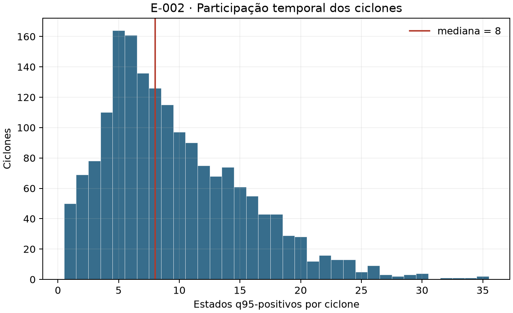
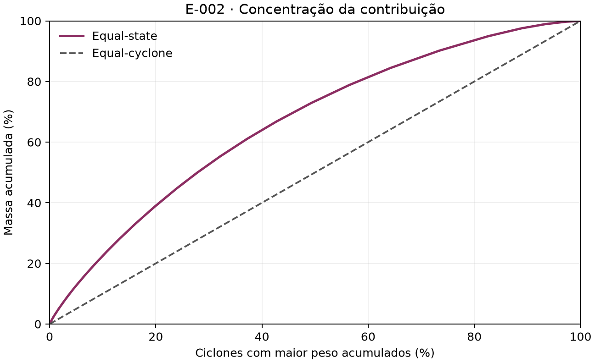
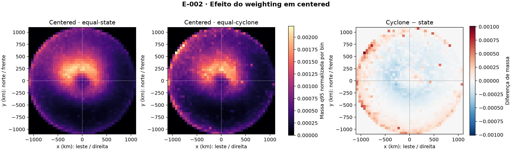
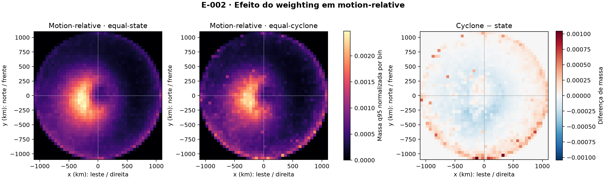
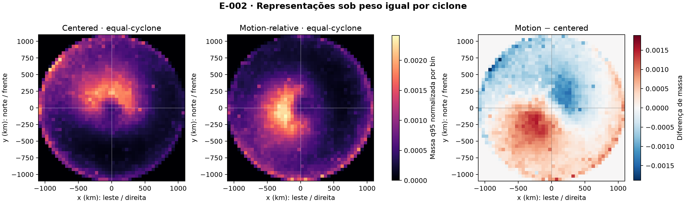
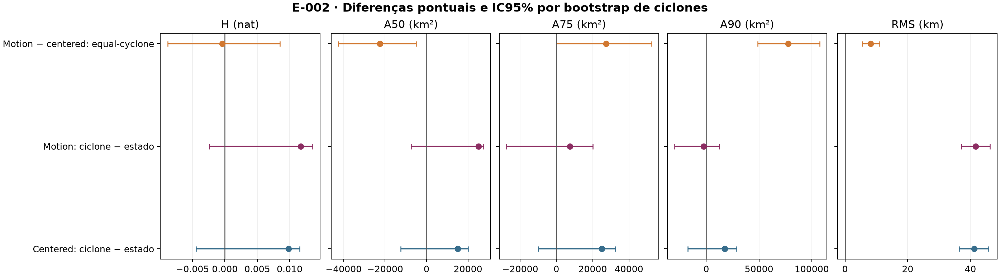

# E-002 — Weighting por estado versus por ciclone

- **Status:** `ADOPTED` — resultado classificado como **ROBUSTO AO WEIGHTING**.
- **Data de planejamento, execução e encerramento:** 21 de setembro de 2026.
- **Questões e decisões relacionadas:** [Q-007](open_questions.md#q-007--a-orientação-pelo-movimento-organiza-melhor-as-excedências), [D-005](decisions.md#d-005--manter-aberta-a-escolha-entre-centered-e-motion-relative-após-e-001) e [D-006](decisions.md#d-006--usar-o-weighting-que-corresponde-ao-estimando-declarado).
- **Experimento anterior:** [E-001](e001_orientation.md) permanece historicamente `INCONCLUSIVE` sob seu protocolo original.

## Contexto

Um ciclone é identificado por `track_id`. Um **estado ciclone–tempo** representa esse ciclone em um campo ERA5 de 6 h. Uma célula q95-positiva é uma posição observável onde a velocidade do vento a 10 m excedeu estritamente o percentil 95 local. O conjunto dessas células num estado é um *excursion set*: uma realização observada de excedências, não um *footprint* probabilístico.

E-001 comparou coordenadas *centered*, nas quais o centro do ciclone é deslocado para a origem e o norte permanece para cima, com coordenadas *motion-relative*, que também giram o campo para colocar o deslocamento do ciclone para a frente. Cada estado q95-positivo recebeu massa total um. Assim, ciclones com mais estados positivos participaram mais vezes do mapa agregado.

## Problema

A unidade científica fundamental do projeto é o ciclone, mas a distribuição de E-001 descreveu a população de estados. A diferença não torna E-001 incorreto: indica que dois estimandos legítimos podem responder a perguntas distintas. E-002 mede quanto a estrutura espacial e a conclusão de E-001 dependem dessa escolha, sem reinterpretar retrospectivamente seu protocolo.

## Pergunta

**Pergunta principal.** A estrutura espacial das excedências q95 muda de forma relevante quando cada ciclone recebe o mesmo peso total, em vez de cada estado q95-positivo receber o mesmo peso?

**Pergunta secundária.** A conclusão `INCONCLUSIVE` de E-001 sobre *centered* versus *motion-relative* permanece quando se remove a participação proporcionalmente maior dos ciclones com muitos estados positivos?

## Hipótese

A hipótese principal previa sensibilidade porque duração e número de estados q95-positivos variam entre ciclones. A hipótese de robustez previa que o conflito observado em E-001 — núcleo A50 mais concentrado, mas regiões intermediária e externa mais dispersas após a rotação — permaneceria sob peso igual por ciclone. A explicação concorrente era que poucos sistemas temporalmente longos produzissem esse conflito; nesse caso, *equal-cyclone* poderia alinhar as métricas em favor de uma representação.

## Por que os dois weightings respondem a perguntas diferentes

**Equal-state** descreve a população de estados: “se um estado q95-positivo for selecionado ao acaso, onde aparecem suas excedências?”. Um ciclone com 20 estados positivos aparece 20 vezes mais que outro com um estado positivo.

**Equal-cyclone** descreve a população de ciclones q95-positivos: “se um ciclone for selecionado ao acaso e sua distribuição interna for observada, qual estrutura é típica entre ciclones?”. Cada ciclone recebe massa total um, independentemente de sua duração representada.

Portanto, *equal-cyclone* não é automaticamente mais correto por o ciclone ser a unidade inferencial. Unidade do bootstrap e estimando descritivo cumprem funções diferentes: o bootstrap por ciclone preserva a dependência; o weighting define qual população o mapa resume.

## Dados

O experimento reutilizou as três entradas de E-001, com hashes validados: catálogo operacional de tracks e **lifecycle** — ciclo de vida categorizado em fases — do Zenodo 18133432, catálogo de estados de 6 h e Parquet condicionado de vento ERA5 a 10 m. O período comparável vai de 1º de janeiro de 2010 a 31 de dezembro de 2020 UTC.

**Suporte espacial** é o conjunto de células da grade de 0,25° situadas simultaneamente no domínio 65°S–10°S, 85°W–15°W e até 1.100 km do centro. Ausência de suporte não foi convertida em não-excedência. E-002 preservou q95 local, seleção, suporte completo ou parcial, transformação azimutal equidistante, corte de heading de 5 km/h, domínio relativo de −1.100 a +1.100 km, bins de 50 km, fases agrupadas e ausência de suavização.

## População reproduzida de E-001

O pipeline interromperia antes dos resultados se qualquer contagem divergisse. A validação reproduziu exatamente:

| Auditoria | Contagem |
| --- | ---: |
| Ciclones elegíveis | 1.784 |
| Estados comparáveis | 23.050 |
| Estados com ao menos uma excedência q95 | 16.921 |
| Células q95 excedentes | 9.090.570 |
| Estados com suporte excluídos por heading < 5 km/h | 284 |
| Ciclones com ao menos um estado q95-positivo | 1.757 |

Vinte e sete ciclones elegíveis não tiveram estado q95-positivo: permaneceram na auditoria e no bootstrap da população elegível, mas não receberam massa em uma distribuição condicionada à ocorrência.

## Equal-state

Sejam $j$ o ciclone, $t$ um estado q95-positivo desse ciclone e $m_{jt}$ o número adimensional de células excedentes no estado. Em *equal-state*, cada célula recebe peso

\[
w_{jt\mathrm{cell}} = \frac{1}{m_{jt}}.
\]

Aqui, $w_{jt\mathrm{cell}}$ é o peso adimensional de uma célula excedente. As células de cada estado somam uma unidade de massa; a soma dos bins é depois normalizada para um. Posições têm unidade de quilômetro e áreas têm km², mas o peso e a probabilidade espacial são adimensionais.

## Equal-cyclone

Se $n_j$ é o número adimensional de estados q95-positivos do ciclone $j$, cada célula recebe

\[
w_{jt\mathrm{cell}} = \frac{1}{n_j m_{jt}}.
\]

As células de cada estado somam $1/n_j$, e todos os estados do ciclone somam uma unidade. A distribuição agregada é normalizada entre os 1.757 ciclones q95-positivos. Dentro de cada fase, $n_j$ conta apenas estados positivos daquela fase; assim, a análise estratificada também compara ciclones com peso total igual no estrato.

## Diagnóstico de contribuição dos ciclones

Para cada `track_id`, o produto reprodutível registra estados elegíveis, estados q95-positivos, duração representada em blocos de 6 h, intervalo entre primeiro e último estado e fração de massa nos dois weightings. A duração de observação é o número de estados multiplicado por 6 h; o intervalo temporal também é fornecido porque uma sequência pode conter lacunas de elegibilidade.

Entre os ciclones positivos, a mediana foi 8 estados; P25 = 5, P75 = 13, P90 = 18, P95 = 20, P99 = 26 e o máximo = 35. O ciclone de maior peso recebeu 0,2068% da massa *equal-state*, contra 0,0569% sob peso igual.

| Grupo ordenado por contribuição *equal-state* | Ciclones | Massa *equal-state* | Massa *equal-cyclone* |
| --- | ---: | ---: | ---: |
| 1% superior | 18 | 3,19% | 1,02% |
| 5% superior | 88 | 12,69% | 5,01% |
| 10% superior | 176 | 22,52% | 10,02% |

O índice de Herfindahl é $HHI=\sum_j a_j^2$, onde $a_j$ é a fração adimensional da massa global do ciclone $j$ e $\sum_j a_j=1$. O número efetivo $N_{eff}=1/HHI$ informa quantos ciclones igualmente ponderados produziriam a mesma concentração. *Equal-state* teve HHI = 0,0007759 e $N_{eff}=1.288,8$; *equal-cyclone*, HHI = 0,0005692 e $N_{eff}=1.757$, seu valor teórico. Para os grupos superiores, 1%, 5% e 10% foram convertidos em número de ciclones pelo teto, resultando em 18, 88 e 176 eventos.

A figura pergunta se poucos ciclones dominam pela quantidade de estados positivos. O eixo horizontal mostra estados por ciclone; o vertical, número de ciclones, e a linha marca a mediana.

<figure class="result-figure">
  
  <figcaption>Participação temporal dos 1.757 ciclones q95-positivos. A maioria possui poucos estados, mas existe uma cauda de sistemas que participa muitas vezes do estimando por estado.</figcaption>
</figure>

**Observação:** a distribuição é assimétrica, mas o maior ciclone isolado responde por apenas 0,21% da massa. **Interpretação:** há concentração agregada relevante, não domínio por um único evento. **Limitação:** número de estados positivos combina duração, seleção, suporte e ocorrência; não mede duração física completa do ciclone.

A próxima figura ordena os ciclones do maior para o menor peso. O eixo horizontal acumula a fração de ciclones e o vertical acumula a massa; a diagonal é o resultado *equal-cyclone*.

<figure class="result-figure">
  
  <figcaption>Concentração da massa entre ciclones. O afastamento da diagonal quantifica a participação adicional de sistemas com mais estados q95-positivos.</figcaption>
</figure>

**Observação:** os 10% superiores concentram 22,52% da massa *equal-state*. **Interpretação:** $N_{eff}$ cai 26,6% em relação aos 1.757 ciclones positivos, uma desigualdade material, porém distribuída. **Limitação:** a curva mede contribuição, não influência causal de cada ciclone sobre uma métrica específica.

## Métricas

As definições são idênticas às de E-001. A entropia de Shannon $H=-\sum_i p_i\ln p_i$, em nat, resume quão espalhada está a massa entre bins; $i$ identifica um bin e $p_i$ é sua massa adimensional normalizada, com $\sum_i p_i=1$. A50, A75 e A90 são o número mínimo de bins necessários para atingir 50%, 75% e 90% da massa multiplicado por 2.500 km². RMS é a raiz da distância quadrática média ao centroide, em km. A distância do centroide ao centro, em km, e a razão entre eixos principais da covariância, adimensional, são diagnósticos de deslocamento e anisotropia; não entram na decisão principal.

A distância de variação total entre os mapas dos dois weightings é

\[
TV=\frac{1}{2}\sum_i\left|p_i^{(ciclone)}-p_i^{(estado)}\right|,
\]

onde $i$ identifica um bin de 50 km e cada $p_i$ é sua massa adimensional normalizada. TV varia de 0 a 1: zero representa mapas idênticos; o valor também é a fração mínima de massa que precisaria ser redistribuída para igualá-los. Ele não ordena qualidade científica.

## Critério de decisão

O critério foi registrado no protocolo antes da execução. E-001 seria **robusto ao weighting** se, sob *equal-cyclone*, A50 continuasse em sentido oposto a A75, A90 e RMS e as cinco métricas de concentração não favorecessem consistentemente uma representação. Seria **sensível** se todas as cinco passassem a apontar para a mesma representação, com IC95% de H e A75 excluindo zero no mesmo sentido, ou se o critério simétrico de E-001 sustentasse claramente uma representação. Situações intermediárias seriam **parcialmente sensíveis**.

Esse critério avalia a conclusão sobre orientação; ele não exige que todos os efeitos do weighting sejam numericamente pequenos.

## Resultados

As quatro distribuições principais produziram:

| Representação | Weighting | H (nat) | A50 (km²) | A75 (km²) | A90 (km²) | RMS (km) | Distância do centroide (km) | Anisotropia |
| --- | --- | ---: | ---: | ---: | ---: | ---: | ---: | ---: |
| Centered | Equal-state | 7,11505 | 967.500 | 1.817.500 | 2.660.000 | 672,06 | 219,92 | 1,0375 |
| Centered | Equal-cyclone | 7,12489 | 982.500 | 1.842.500 | 2.677.500 | 713,22 | 220,14 | 1,0102 |
| Motion-relative | Equal-state | 7,11276 | 935.000 | 1.862.500 | 2.757.500 | 679,75 | 194,58 | 1,0224 |
| Motion-relative | Equal-cyclone | 7,12448 | 960.000 | 1.870.000 | 2.755.000 | 721,43 | 190,56 | 1,0360 |

As duas linhas *equal-state* reproduziram as áreas de E-001 exatamente e as métricas contínuas com diferença absoluta inferior a $10^{-6}$; os resumos bootstrap de E-001 também foram reproduzidos dentro de $10^{-6}$.

## Efeito do weighting

Diferenças abaixo são *equal-cyclone minus equal-state*. Valores positivos de H, área ou RMS representam maior dispersão sob peso igual por ciclone.

| Representação | ΔH (nat) | ΔA50 (km²) | ΔA75 (km²) | ΔA90 (km²) | ΔRMS (km) | TV |
| --- | ---: | ---: | ---: | ---: | ---: | ---: |
| Centered | +0,00983 | +15.000 | +25.000 | +17.500 | +41,16 | 0,07920 |
| Motion-relative | +0,01171 | +25.000 | +7.500 | −2.500 | +41,68 | 0,07858 |

O mapa *centered* abaixo compara os dois estimandos na mesma escala; o terceiro painel é *equal-cyclone minus equal-state*.

<figure class="result-figure">
  
  <figcaption>Efeito do weighting em coordenadas centered. Tons claros nos dois primeiros painéis indicam maior massa; vermelho e azul no terceiro indicam ganho e perda sob equal-cyclone.</figcaption>
</figure>

**Observação:** 7,92% da massa precisa ser redistribuída entre bins e o RMS aumenta 41,16 km. **Interpretação:** ciclones com menos estados positivos ampliam a dispersão radial média quando recebem peso igual. **Limitação:** o mapa agregado não identifica quais ciclones geram cada deslocamento.

O mapa *motion-relative* usa direita/frente como eixos e mantém a mesma leitura.

<figure class="result-figure">
  
  <figcaption>Efeito do weighting após alinhar o movimento para cima. O weighting redistribui 7,86% da massa e eleva o RMS em 41,68 km.</figcaption>
</figure>

**Observação:** a magnitude global da redistribuição é quase igual à de *centered*, embora A90 diminua 2.500 km². **Interpretação:** a sensibilidade ao weighting não depende apenas da orientação. **Limitação:** TV não informa se uma redistribuição é fisicamente preferível.

## Robustez da conclusão de E-001

A comparação *motion-relative minus centered* foi:

| Weighting | ΔH (nat) | ΔA50 (km²) | ΔA75 (km²) | ΔA90 (km²) | ΔRMS (km) |
| --- | ---: | ---: | ---: | ---: | ---: |
| Equal-state | −0,00229 | −32.500 | +45.000 | +97.500 | +7,69 |
| Equal-cyclone | −0,00041 | −22.500 | +27.500 | +77.500 | +8,21 |

<figure class="result-figure">
  
  <figcaption>Comparação de orientação quando cada ciclone recebe massa total igual. Motion-relative mantém núcleo A50 menor, mas A75, A90 e RMS maiores.</figcaption>
</figure>

**Observação:** o conflito núcleo–cauda permanece, embora as diferenças de área diminuam. **Interpretação:** a conclusão de E-001 não foi produzida pela participação desproporcional dos ciclones mais longos. **Limitação:** robustez a este weighting não implica robustez a thresholds, tamanho do ciclone ou novas amostras.

## Resultado por fase

A tabela mostra *equal-cyclone minus equal-state* dentro das quatro fases principais; valores de H, áreas e RMS têm as mesmas unidades da análise global.

| Fase | Representação | ΔH | ΔA50 | ΔA75 | ΔA90 | ΔRMS |
| --- | --- | ---: | ---: | ---: | ---: | ---: |
| Incipiente | Centered | −0,01133 | −32.500 | −10.000 | −5.000 | +12,90 |
| Incipiente | Motion-relative | −0,00744 | −17.500 | −12.500 | −7.500 | +14,08 |
| Intensificação | Centered | +0,02391 | +32.500 | +55.000 | +50.000 | +35,62 |
| Intensificação | Motion-relative | +0,03036 | +47.500 | +60.000 | +62.500 | +37,97 |
| Madura | Centered | +0,00294 | −7.500 | +17.500 | +32.500 | +13,51 |
| Madura | Motion-relative | −0,00724 | −12.500 | +5.000 | +20.000 | +12,19 |
| Decaimento | Centered | −0,02905 | −57.500 | −80.000 | −65.000 | +26,25 |
| Decaimento | Motion-relative | −0,02137 | −37.500 | −95.000 | −92.500 | +28,03 |

O $N_{eff}$ *equal-state* foi 767,3 de 1.051 ciclones positivos na fase incipiente, 1.132,9 de 1.611 na intensificação, 735,8 de 923 na madura e 873,3 de 1.296 no decaimento. A perda relativa foi maior no decaimento, seguido de intensificação. O efeito espacial não foi homogêneo: peso igual aumentou áreas na intensificação, reduziu-as no decaimento e produziu sinais mistos na fase madura. Como esta estratificação é secundária e não recebeu bootstrap próprio, ela localiza heterogeneidade, mas não domina a conclusão global.

## Incerteza

Foram geradas 500 réplicas com semente 20260921. Em cada uma, os 1.784 ciclones elegíveis foram reamostrados com reposição; todos os estados e células de cada seleção foram preservados, e ambos os weightings foram recalculados. A tabela apresenta estimativa observada e IC95% percentil.

| Contraste | Métrica | Estimativa | IC95% |
| --- | --- | ---: | ---: |
| Centered: ciclone − estado | H | +0,00983 | [−0,00444; +0,01156] |
|  | A50 | +15.000 | [−12.500; +20.000] |
|  | A75 | +25.000 | [−10.000; +32.500] |
|  | A90 | +17.500 | [−17.500; +28.812] |
|  | RMS | +41,16 | [+36,36; +45,80] |
| Motion: ciclone − estado | H | +0,01171 | [−0,00239; +0,01356] |
|  | A50 | +25.000 | [−7.500; +27.500] |
|  | A75 | +7.500 | [−27.500; +20.000] |
|  | A90 | −2.500 | [−30.000; +12.500] |
|  | RMS | +41,68 | [+37,14; +46,27] |
| Motion − centered: equal-cyclone | H | −0,00041 | [−0,00883; +0,00847] |
|  | A50 | −22.500 | [−42.500; −5.000] |
|  | A75 | +27.500 | [0; +52.500] |
|  | A90 | +77.500 | [+48.688; +107.500] |
|  | RMS | +8,21 | [+5,57; +11,07] |

<figure class="result-figure">
  
  <figcaption>Diferenças pontuais e IC95% por ciclone. Cada painel possui sua própria unidade; a linha vertical marca ausência de diferença.</figcaption>
</figure>

**Observação:** os IC das áreas e de H para o efeito do weighting incluem zero, mas o aumento de RMS é consistente nas duas representações. Sob *equal-cyclone*, A50 favorece *motion-relative*, enquanto A90 e RMS favorecem *centered*; H inclui zero e A75 toca zero. **Interpretação:** há evidência de maior dispersão radial entre ciclones igualmente ponderados, mas não de uma mudança coerente em todas as medidas de concentração. **Limitação:** o bootstrap quantifica incerteza interna deste experimento; não substitui análise de influência, remoção de ciclones ou validação fora da amostra.

## Interpretação

O esquema *equal-state* não foi dominado por um ciclone ou por um grupo minúsculo, mas deu influência agregada material aos sistemas com mais estados positivos: os 10% superiores receberam 22,52% da massa, e $N_{eff}$ caiu de 1.757 para 1.288,8. Remover essa desigualdade deslocou cerca de 8% da massa espacial e aumentou RMS em aproximadamente 41 km.

Essas mudanças quantitativas não alteraram a narrativa de orientação. Sob ambos os estimandos, *motion-relative* concentra A50 e dispersa A75, A90 e RMS em relação a *centered*. E-002 é, portanto, **ROBUSTO AO WEIGHTING** segundo o critério registrado.

## Limitações

- q95 permaneceu fixo; q90, q99 e thresholds físicos não foram testados.
- O produto de vento é um recorte condicionado de 2010–2020 e não uma climatologia completa.
- Duração representada não é duração física completa e também depende de suporte, heading e ocorrência q95.
- Fases foram analisadas como fornecidas e agrupadas segundo E-001; não se controlou intensidade.
- Não houve remoção de ciclones influentes, *leave-one-cyclone-out* nem validação em grupos não usados na construção.
- A análise compara distribuições condicionadas à ocorrência; não estima *coverage probability*, magnitude condicional, *footprint* probabilístico ou hazard geográfico.

## Conclusão

O weighting altera de forma mensurável a distribuição — TV próxima de 0,079 e RMS cerca de 41 km maior sob peso igual por ciclone — mas não muda qualitativamente a comparação entre orientações. A conclusão de E-001 permanece `INCONCLUSIVE` sob seu protocolo original e mostrou-se **ROBUSTA AO WEIGHTING** em E-002.

## Consequência para o projeto

Nenhum weighting foi eleito universalmente principal. Conforme [D-006](decisions.md#d-006--usar-o-weighting-que-corresponde-ao-estimando-declarado), *equal-state* deve ser usado quando a pergunta-alvo é sobre a população de estados q95-positivos; *equal-cyclone*, quando a pergunta é sobre a população de ciclones q95-positivos. O estimando deve ser declarado e o outro weighting deve permanecer como análise de sensibilidade quando pertinente.

Também não foi adotada uma orientação espacial superior. O próximo teste independente é a sensibilidade ao threshold; lifecycle versus intensidade, estabilidade e generalização por ciclone e o modelo probabilístico completo permanecem futuros.

## Reprodutibilidade

O protocolo congelado está em `scripts/04_e002_weighting/protocol.json`; o código e os testes, em `scripts/04_e002_weighting/`; e os produtos, em `outputs/04_e002_weighting/`. `summary.json` registra hashes das entradas, protocolo, script e resumo de E-001, além da semente. `cyclone_contributions.csv`, `metrics.csv`, `metric_comparisons.csv`, `bootstrap_differences.csv`, `spatial_distributions.csv` e `contribution_concentration_by_phase.csv` preservam os resultados tabulares. A sequência de execução está em [proveniência e reprodutibilidade](reproducibility.md#e-002--sensibilidade-ao-weighting).

## Respostas finais de E-002

1. **Ciclones com muitos estados dominavam materialmente E-001?** Havia desigualdade material agregada, mas não domínio por poucos eventos: os 10% superiores reuniam 22,52% da massa, o maior ciclone apenas 0,21%, e $N_{eff}=1.288,8$ entre 1.757 ciclones positivos.
2. **Dar peso igual a cada ciclone altera de forma cientificamente relevante a estrutura?** Sim, de forma moderada: cerca de 8% da massa foi redistribuída e RMS aumentou aproximadamente 41 km. A maior parte dos IC para H e áreas inclui zero, portanto a mudança não é coerente em todas as métricas.
3. **A conclusão de E-001 permanece robusta?** Sim. O conflito entre núcleo e cauda permanece e nenhuma orientação se torna consistentemente superior.
