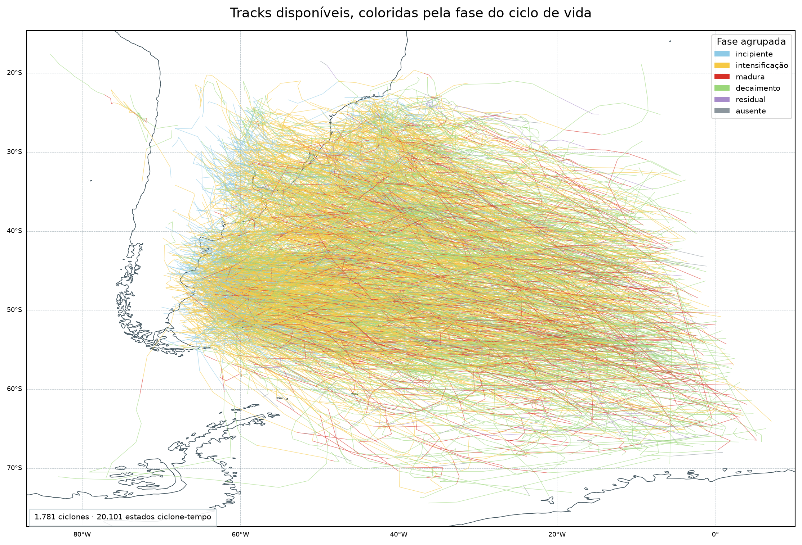

# Análise exploratória dos ventos associados aos ciclones

## Motivação

Antes de ajustar modelos, é necessário compreender a cobertura da amostra, a distribuição dos ventos armazenados e os sinais descritivos de organização em relação ao ciclone. Esta análise pergunta se fases do ciclo de vida e setores espaciais apresentam diferenças visíveis que justifiquem experimentos posteriores.

Ela é estritamente **descritiva**: não estima incerteza entre ciclones, não testa hipóteses e não produz *coverage probability*, *footprint* probabilístico ou hazard geográfico.

## Perguntas exploradas

1. Onde estão as tracks presentes no recorte de vento e quais fases elas cobrem?
2. Como a distribuição pontual de `wind_speed` varia entre fases?
3. As distribuições pontuais diferem entre quadrantes geográficos e quadrantes relativos ao movimento?
4. Em quantos estados ciclone–tempo há ao menos uma excedência de cada threshold?
5. Como contagens q90 e proporções q95 se distribuem entre fases e quadrantes?
6. Como os pontos q90 de um ciclone individual evoluem no espaço e no tempo?

## Dados e população

A análise usa o recorte condicionado de vento de 2010–2020. Ele contém **1.781 ciclones**, **20.101 estados ciclone–tempo** e **17.182.983 linhas de pontos de grade**. O ciclone, identificado por `track_id`, é a unidade científica fundamental quando aplicável. Um estado ciclone–tempo é um ciclone em um horário ERA5 de 6 h; cada estado pode contribuir com muitos pontos espaciais.

O recorte não contém toda a grade nem todos os estados. Uma linha foi armazenada quando o ponto estava a até 1.100 km do centro e satisfazia `wind_speed > min(15,6 m/s; q90_local)`. Portanto, estatísticas sobre linhas descrevem uma população já selecionada por vento e não podem ser interpretadas como climatologia completa.

Para apresentação, `intensification 2`, `mature 2` e `decay 2` foram reunidas às fases principais correspondentes. O sufixo indica uma ocorrência posterior não contígua na mesma track, não uma classe física diferente. Os rótulos originais permanecem preservados; `residual` e fase ausente continuam separados.

## Método descritivo

- Centros distintos por ciclone e horário foram usados para mapear as tracks.
- Quantis e boxplots de `wind_speed` foram calculados sobre linhas espaciais, com identificação explícita de que esses pontos não são observações independentes.
- Para ocorrência de thresholds, cada par `track_id + time` conta no máximo uma vez por threshold, desde que tenha ao menos um ponto excedente.
- Para fase e quadrante, foram comparadas contagens de pontos q90 e a porcentagem das linhas do recorte que também excedem q95.
- O exemplo individual foi escolhido por regra anterior ao exame visual: o ciclone que contém o maior `wind_speed` do arquivo.

Os quadrantes geográficos são noroeste, nordeste, sudeste e sudoeste. Os quadrantes *motion-relative* giram com o deslocamento do ciclone e representam frente–esquerda, frente–direita, trás–direita e trás–esquerda. Essa exploração formulou a hipótese depois testada com coordenadas contínuas em [E-001](e001_orientation.md); o resultado formal foi inconclusivo.

## Resultados

### 1. Cobertura das tracks e fases

A primeira figura responde onde se concentram os centros dos 1.781 ciclones presentes no recorte e como as fases aparecem ao longo das trajetórias. Cada segmento liga estados consecutivos e recebe a cor da fase no ponto final; a costa fornece referência geográfica.

**Observação.** As tracks ocupam uma faixa ampla do Atlântico Sul e se sobrepõem intensamente. A figura confirma cobertura espacial heterogênea e mostra que diferentes fases ocorrem ao longo das trajetórias.

**Interpretação.** A sobreposição não é uma estimativa de densidade de ciclones nem de hazard; ela apenas localiza os centros dos sistemas selecionados. A população exibida exclui ciclones e estados sem linhas no recorte condicionado.

### 2. Vento pontual por fase e quadrante

A figura seguinte compara a distribuição de `wind_speed`, em m/s, entre fases agrupadas e entre as duas convenções de quadrante. Cada caixa mostra P25–P75, a linha central é a mediana, as hastes são P5–P95 e o ponto branco é a média. A população é formada pelas linhas espaciais armazenadas, não por resumos independentes por ciclone.

| Fase agrupada | Ciclones | Estados | Linhas espaciais | Mediana | P95 |
| --- | ---: | ---: | ---: | ---: | ---: |
| Incipiente | 1.124 | 2.368 | 1.583.894 | 12,07 m/s | 16,49 m/s |
| Intensificação | 1.687 | 8.340 | 7.646.684 | 14,38 m/s | 18,16 m/s |
| Madura | 1.024 | 2.051 | 2.586.389 | 15,58 m/s | 19,77 m/s |
| Decaimento | 1.439 | 6.355 | 4.704.434 | 14,97 m/s | 18,67 m/s |
| Residual | 66 | 237 | 151.794 | 14,54 m/s | 18,26 m/s |
| Ausente | 677 | 750 | 509.788 | 14,05 m/s | 18,00 m/s |

Um ciclone pode contribuir para várias fases; a coluna de ciclones não deve ser somada.

**Observação.** A fase madura apresentou a maior mediana pontual, 15,58 m/s, e o maior P95 pontual, 19,77 m/s. As medianas por quadrante foram próximas: 14,47–14,90 m/s nos quadrantes geográficos e 14,51–14,78 m/s nos quadrantes relativos ao movimento.

**Interpretação.** O padrão é consistente com ventos mais intensos entre os pontos armazenados da fase madura. Ele não demonstra que a fase cause ventos mais fortes nem estabelece diferença entre ciclones, porque ciclones longos e estados com mais pontos têm maior peso.

### 3. Ocorrência de excedências por estado

Para reduzir a repetição de pixels, a próxima figura pergunta se cada estado ciclone–tempo contém pelo menos uma excedência. O painel superior apresenta o número de estados por fase e threshold; o inferior divide cada contagem pelo total de estados da fase. São mostrados 15,6, 20 e 25 m/s, q95 e q99. q90 não é exibido porque define aproximadamente o recorte de entrada.

**Observação.** Entre 2.051 estados maduros, 1.658 contêm ao menos um ponto acima de 15,6 m/s, 652 acima de 20 m/s, 42 acima de 25 m/s, 1.848 acima de q95 e 1.265 acima de q99. As contagens absolutas são maiores na intensificação para vários thresholds porque essa fase fornece 8.340 estados, a maior população.

**Interpretação.** Contagem absoluta e fração respondem perguntas diferentes. A primeira combina ocorrência com o número de estados disponíveis; a segunda descreve a presença de ao menos um ponto excedente dentro de cada fase. Nenhuma delas ajusta dependência entre estados do mesmo ciclone ou cobertura espacial desigual.

### 4. Fase e setores espaciais

Os heatmaps seguintes investigam se excedências se distribuem de forma assimétrica. As duas linhas superiores mostram contagens de pontos q90 nos quadrantes geográficos e relativos ao movimento; a escala de cor é logarítmica para acomodar ordens de grandeza distintas. As duas linhas inferiores mostram, em porcentagem, quantas linhas já selecionadas também excedem q95.

**Observação.** A fase madura apresenta as maiores porcentagens q95 em vários setores. No sistema geográfico, por exemplo, a proporção chega a 66,69% no quadrante noroeste. As contagens q90 são dominadas por fases e quadrantes que também contêm mais linhas.

**Interpretação.** Os mapas sugerem estrutura a investigar, mas misturam frequência de estados, duração, área selecionada e contribuição desigual de ciclones. Eles não estimam a probabilidade de cobertura de uma posição relativa e não permitem escolher entre o referencial geográfico e o relativo ao movimento.

### 5. Um evento individual

O exemplo visual pergunta como os pontos q90 evoluem durante uma única track. O ciclone `20100510` foi selecionado porque contém o maior vento do recorte: **34,85 m/s**, em 18 de junho de 2010 às 06:00 UTC, durante intensificação. A animação percorre os 25 estados com linhas armazenadas entre 13 e 19 de junho. O catálogo completo contém 32 estados de 6 h: um posterior ainda possui suporte, mas zero linhas selecionadas, e os seis últimos não intersectam o domínio.

<video controls loop muted playsinline preload="metadata" poster="../outputs/02_exploratory_analysis/max_wind_cyclone_peak_frame.png" style="display:block;width:100%;height:auto">
  <source src="../outputs/02_exploratory_analysis/max_wind_cyclone_animation.mp4" type="video/mp4">
  Seu navegador não conseguiu reproduzir o vídeo. Abra o arquivo na seção de reprodutibilidade.
</video>

Em ambos os painéis, pontos coloridos são linhas com `exceeded_q90 = true`, e a cor representa `wind_speed` em m/s. O círculo tem raio de 1.100 km; o centro é colorido pela fase. À esquerda, as linhas radiais delimitam quadrantes geográficos; à direita, quadrantes orientados pelo deslocamento. A linha escura mostra o caminho já percorrido e a tracejada, o restante da track presente no recorte.

**Observação.** O campo selecionado muda de extensão e intensidade ao longo do ciclo, e o máximo ocorre na fase de intensificação desse caso específico.

**Interpretação.** Um caso ilustra a representação e ajuda a detectar problemas de suporte, mas não caracteriza a população. Áreas brancas significam apenas “não desenhado”: elas podem representar células abaixo do filtro, ausência reconstruível ou posições fora do suporte. O vídeo não é um *footprint* probabilístico.

## O que aprendemos

- A amostra de vento tem ampla cobertura de tracks, mas é condicionada por um filtro e por um domínio espacial finito.
- A fase madura concentra os maiores quantis pontuais no recorte; isso é uma associação descritiva, não uma comparação inferencial entre ciclones.
- Diferenças de mediana entre quadrantes são pequenas, enquanto algumas proporções q95 variam; a utilidade dos referenciais ainda precisa ser testada.
- Contar estados, pontos ou ciclones produz estimandos diferentes. Experimentos futuros devem declarar qual unidade responde à pergunta.
- Estados ausentes e regiões brancas só podem ser interpretados depois de verificar o suporte espacial.

## Limitações

1. O arquivo armazena apenas pontos que passaram por `wind_speed > min(15,6 m/s; q90_local)`; distribuições pontuais não representam todo o campo ERA5.
2. Os percentis locais usam 2010–2020 e ainda serão revistos para o período maior pretendido; não são o threshold definitivo.
3. Ciclones, estados e pontos contribuem desigualmente; boxplots e heatmaps não corrigem pseudorreplicação.
4. Fase está ausente em 509.788 linhas, e a execução original do CycloPhaser não é integralmente reproduzível.
5. O círculo de 1.100 km é truncado nas bordas; 5.977 estados do período não possuem suporte e 3.233 têm suporte mas zero linhas selecionadas.
6. Não há teste de significância, intervalo de incerteza por ciclone, validação fora da amostra ou análise de sensibilidade.
7. Evento, climatologia, *excursion set*, *footprint* e hazard permanecem objetos distintos; esta análise não transforma um no outro.

## O que isso motiva

Os resultados justificaram formular E-001 sem antecipar sua conclusão. O experimento posterior fixou q95, pesos por estado, suporte, métricas e bootstrap por ciclone e encontrou evidência conflitante entre núcleo e cauda. Definição final de extremo, objeto espacial e modelos de ocorrência ou magnitude continuam pendentes.

## Reprodutibilidade

Tabelas completas, versão da entrada, regra de seleção do caso, código e produtos estão reunidos em [proveniência e reprodutibilidade](reproducibility.md). Esta página não depende do código para ser compreendida; os vínculos técnicos servem à auditoria e à reprodução.
