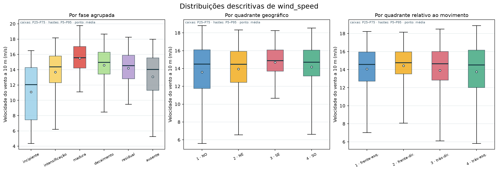
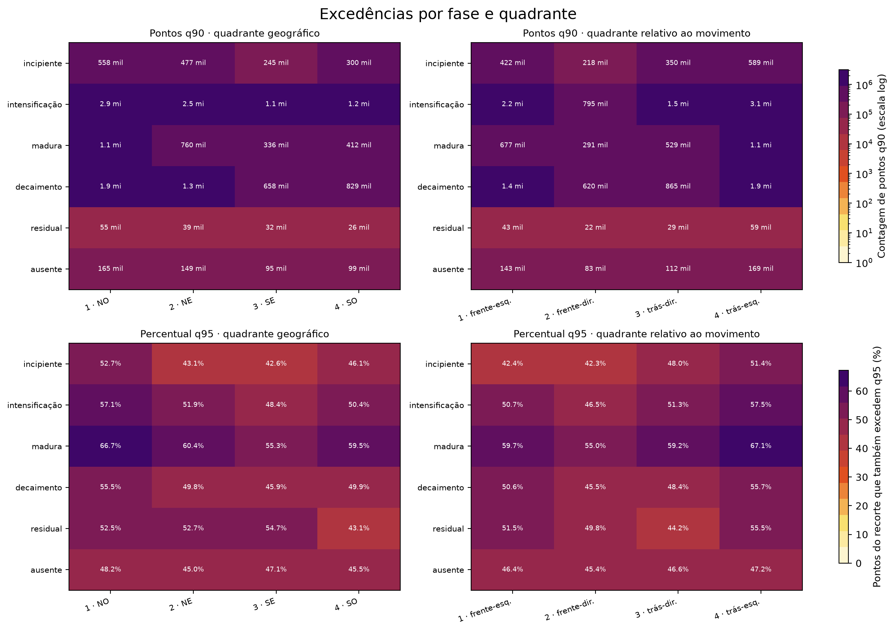
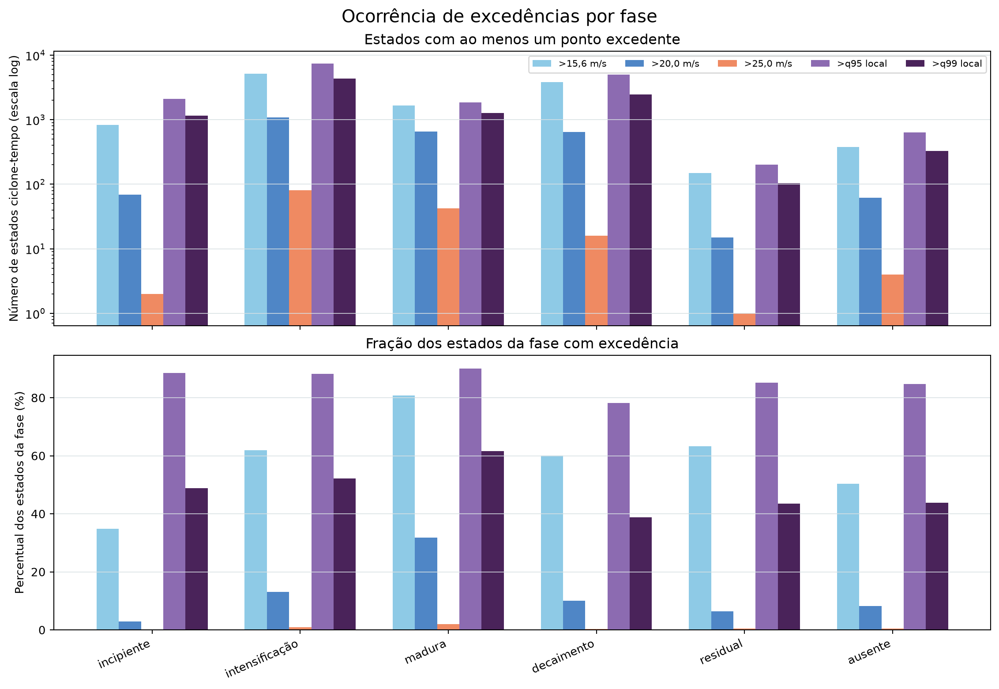

# Resultados e evidências

## Como ler esta síntese

Esta página reúne somente evidências já produzidas. Cada item separa **resultado observado**, **interpretação permitida** e **conclusão ainda não permitida**. Números detalhados e figuras estão na [análise exploratória](exploratory_analysis.md); regras de construção estão em [preparação dos dados](data_preparation.md).

## Evidência 1 — a fonte operacional reproduz o recorte existente

**Resultado.** O catálogo reconstruído a partir do Zenodo reproduziu os 20.101 centros e os 20.101 rótulos de fase presentes no recorte de vento, sem estados inesperados. Ele recuperou ainda 9.210 estados do período que não possuem linhas no recorte: 3.233 com suporte e 5.977 sem interseção com o domínio.

**Interpretação.** O Zenodo fornece o denominador temporal e preserva o namespace necessário para auditar presença, ausência e suporte. Isso sustenta sua adoção como fonte operacional.

**Não permite concluir.** A correspondência não valida a escolha científica do raio, dos thresholds ou da classificação original do lifecycle.

## Evidência 2 — o recorte é grande, mas não é uma amostra de linhas independentes

**Resultado.** O arquivo atual contém 1.781 ciclones, 20.101 estados ciclone–tempo e 17.182.983 linhas espaciais.

**Interpretação.** Há informação espacial e temporal abundante, porém organizada hierarquicamente: muitos pontos pertencem ao mesmo estado e muitos estados pertencem ao mesmo ciclone.

**Não permite concluir.** O número de linhas não pode ser usado como tamanho amostral inferencial. Precisão aparente calculada como se fossem 17 milhões de eventos seria pseudorreplicação.

## Evidência 3 — quantis pontuais são maiores na fase madura

**Resultado.** No recorte condicionado, a fase madura apresentou mediana pontual de 15,58 m/s e P95 de 19,77 m/s, os maiores entre as fases agrupadas. Na fase incipiente, os valores correspondentes foram 12,07 e 16,49 m/s.

A figura compara as distribuições pontuais de `wind_speed`, em m/s, por fase agrupada, quadrante geográfico e quadrante relativo ao movimento. Em cada boxplot, a caixa representa P25–P75, a linha central é a mediana, as hastes são P5–P95 e o ponto branco é a média. A população mostrada é formada pelas linhas espaciais selecionadas, não por ciclones independentes.

<figure class="result-figure">
  
  <figcaption>Distribuições pontuais no recorte condicionado de 2010–2020. A fase madura apresenta a maior mediana e o maior P95; as medianas dos quadrantes são próximas.</figcaption>
</figure>

**Interpretação.** Entre os pontos armazenados, o padrão é consistente com intensidades maiores na fase madura. É uma hipótese plausível para testes por ciclone.

**Não permite concluir.** Não houve teste inferencial, controle de duração, cobertura ou seleção; portanto, não se demonstrou que fases diferem na população nem que maturidade causa ventos mais fortes.

## Evidência 4 — medianas entre quadrantes são próximas

**Resultado.** As medianas pontuais variaram de 14,47 a 14,90 m/s nos quadrantes geográficos e de 14,51 a 14,78 m/s nos quadrantes relativos ao movimento.

**Interpretação.** A mediana, isoladamente, não mostra grande contraste entre setores no recorte. Outras partes da distribuição e a ocorrência podem conter estrutura.

**Não permite concluir.** Não se comparou desempenho de referenciais, estabilidade por ciclone ou incerteza. O referencial relativo ao movimento não foi validado como superior.

## Evidência 5 — proporções q95 variam entre fase e setor

**Resultado.** Entre linhas já selecionadas, a fase madura apresentou as maiores proporções q95 em vários quadrantes; no noroeste geográfico, 66,69% das linhas q90 também excederam q95.

Os heatmaps abaixo mostram contagens de pontos q90 nos dois sistemas de quadrantes, nas linhas superiores, e a porcentagem das linhas selecionadas que também excede q95, nas inferiores. Cores mais escuras representam valores maiores; a escala das contagens é logarítmica para acomodar diferenças grandes entre fases.

<figure class="result-figure">
  
  <figcaption>Fase e setor espacial no recorte condicionado. As proporções q95 maiores em parte da fase madura são descritivas e não constituem coverage probability.</figcaption>
</figure>

**Interpretação.** Há um sinal descritivo de concentração de ventos mais intensos em combinações específicas de fase e setor, suficiente para motivar hipóteses.

**Não permite concluir.** A proporção é condicionada ao recorte, depende do número de pontos por estado e não é uma *coverage probability* espacial.

## Evidência 6 — ausência precisa ser separada de não observação

**Resultado.** No período comparável, 3.233 estados têm suporte e zero linhas selecionadas, enquanto 5.977 não possuem nenhuma célula dentro do domínio e do raio. Há também 1.833 estados presentes cujo centro fica fora do domínio, produzindo suporte parcial.

**Interpretação.** O denominador espacial pode ser reconstruído para estados com suporte, e a parte fora do domínio deve permanecer como não observada.

**Não permite concluir.** Áreas brancas em figuras ou ausência de linhas não podem ser classificadas automaticamente como vento zero ou não-excedência.

## Evidência visual complementar — ocorrência por estado

Para evitar que a quantidade de pixels domine a leitura, esta figura conta cada par ciclone–tempo uma única vez por threshold quando existe ao menos um ponto excedente. O painel superior mostra o número de estados; o inferior, a fração dentro de cada fase. A população inclui os 20.101 estados presentes no recorte de vento.

<figure class="result-figure">
  
  <figcaption>Ocorrência de ao menos uma excedência por estado. Contagens absolutas e frações respondem a perguntas diferentes e ainda preservam dependência entre estados do mesmo ciclone.</figcaption>
</figure>

**Observação.** A intensificação fornece o maior número de estados e, por isso, domina várias contagens absolutas. A fase madura apresenta frações elevadas para diversos thresholds.

**Limitação.** A figura não corrige duração, suporte espacial desigual ou dependência entre estados do mesmo ciclone; ela não é um teste inferencial entre fases.

## Evidência 7 — orientar pelo movimento não concentrou toda a distribuição q95

**Resultado.** [E-001](e001_orientation.md) comparou 1.784 ciclones e 23.050 estados nas mesmas células e bins. Os quadrantes rotacionados pelo movimento (`motion-relative`) reduziram A50 em 32.500 km², mas aumentaram A75 em 45.000 km², A90 em 97.500 km² e RMS em 7,69 km em relação aos quadrantes fixos (`centered`). A diferença de entropia foi −0,0023 nat, com IC bootstrap de 95% entre −0,0105 e +0,0057. Apenas a intensificação teve entropia e A75 pontualmente menores em conjunto.

**Interpretação.** A rotação concentrou o núcleo e revelou assimetria atrás e à esquerda do movimento, mas dispersou as regiões intermediária e externa. Não houve melhora global consistente segundo o critério preregistrado.

**Não permite concluir.** O resultado não prova que os quadrantes fixos sejam fisicamente superiores, não resolve weighting por ciclone, não escolhe threshold definitivo e não constitui uma probabilidade espacial.

## Evidência 8 — a conclusão de orientação é robusta ao weighting

**Resultado.** [E-002](e002_weighting.md) mostrou que os 10% de ciclones q95-positivos com mais estados recebiam 22,52% da massa *equal-state*, ante 10,02% com peso igual. O número efetivo aumentou de 1.288,8 para 1.757 ciclones ao usar *equal-cyclone*. A mudança redistribuiu 7,92% da massa *centered* e 7,86% da massa *motion-relative* e aumentou RMS em 41,16 e 41,68 km, respectivamente.

Sob *equal-cyclone*, *motion-relative minus centered* foi −22.500 km² em A50, +27.500 km² em A75, +77.500 km² em A90 e +8,21 km em RMS. Os IC95% foram [−42.500; −5.000], [0; +52.500], [+48.688; +107.500] e [+5,57; +11,07], respectivamente; o IC de ΔH incluiu zero.

**Interpretação.** Sistemas com mais estados positivos tinham influência agregada material, mas não explicavam o conflito entre núcleo e cauda. A conclusão `INCONCLUSIVE` de E-001 é robusta a este weighting.

**Não permite concluir.** Robustez ao weighting não escolhe uma orientação, não torna os dois estimandos intercambiáveis e não demonstra robustez a threshold, influência individual ou amostras futuras.

## Síntese científica atual

A infraestrutura observacional está validada para continuar: fonte, estados, suporte e regras do recorte são conhecidos o suficiente para formular experimentos. A exploração sugere variação por fase e estrutura setorial; E-001 mostrou que alinhar pelo movimento muda a forma, mas não aumenta consistentemente a concentração, e E-002 mostrou que essa conclusão é robusta a peso por estado versus por ciclone. O próximo teste proposto é a sensibilidade ao threshold. O projeto ainda não estimou ocorrência probabilística, magnitude condicional, *footprint* ou hazard.
